# Analisis Sistem — POS Multi-Toko (Laravel + Inertia + Vue/Quasar)

> **PEMBARUAN v0.9 (26 Okt 2026, D34): sistem ONLINE ONLY, 1 hosting.** Arsitektur sekarang **Laravel + Inertia (Vue) + Quasar sebagai pustaka UI dalam satu aplikasi** (aplikasi Laravel di root proyek, tanpa folder `backend/`/`frontend/`; tanpa SPA/API terpisah). Offline/PWA/sinkron/backup lokal/R3 **dibatalkan**. Semua uraian offline di dokumen ini (0, 4.1, 4.2, 4.4, BPMN-8, 7.x, 9, 10) adalah **riwayat dan dianggap tidak berlaku**; pembersihan menyeluruh dijadwalkan bersama revisi mockup.
>
> **Wireframe ditulis ulang (v1.0):** tampilan modern dan ringkas, dipisah per rilis: [`wireframe.html`](wireframe.html) (R1, 24 layar) dan [`wireframe-r2.html`](wireframe-r2.html) (R2, menyusul). Diagram juga dipisah: [`diagram.html`](diagram.html) (R1) dan [`diagram-r2.html`](diagram-r2.html) (R2; ERD R2 hanya penambahan di atas skema R1: 6.2r, 6.3r, 6.3b, 6.4r). Penomoran layar lama ("layar 14", "wireframe 16 & 23", dst.) di dokumen ini **tidak berlaku lagi**.
>
> Status: **Draft v0.9 (online only; R1 Inti = operasional harian toko; tanpa penerimaan, tanpa Form Harga & histori harga)** · Bahasa dokumen: Indonesia · **Nama tabel & kolom DB: Inggris, snake_case, jamak** · Wireframe: [R1](wireframe.html) · [R2](wireframe-r2.html) · Diagram: [R1](diagram.html) · [R2](diagram-r2.html) · Biaya: [`estimasi-biaya.md`](estimasi-biaya.md)
> DB `mitra_utama_existing` hanya referensi kebutuhan & pelajaran, **bukan** dasar desain.

---

## 0. Ringkasan Eksekutif

**Sistem:** POS multi-toko, **1 database per toko**, ditambah aplikasi pusat (login, master toko, **master toko**, user & hak akses; **master barang ada di tiap toko**). Sistem **online saja** (D34): kasir butuh internet; bila internet mati, cadangannya adalah catat manual lalu input nota susulan / tethering ponsel. ~~Offline PWA + backup lokal~~ dibatalkan demi deployment sederhana di 1 hosting.

### 0.1 Perubahan di v0.3 (dari jawaban pertanyaan 10.2)

| # | Jawaban Anda | Dampak desain |
|---|--------------|---------------|
| 1 | Katalog bersama; toko A boleh *beli* satuan PCS, toko B hanya DUS | Kebijakan satuan **per toko** (`product_units.is_purchasable`, `is_sellable`), diatur **Admin Toko** per toko (katalog bersama dihapus di v0.6) |
| 2 | Transfer antar-toko: Fase 2, sementara opname parsial | Tidak berubah |
| 3 | Opname stok awal OK "selama bisa migrasi" | Migrasi menyiapkan template opname + impor saldo awal (7.11) |
| 4 | Konversi 137 barang multi-satuan diisi lewat Claude + impor Excel | Skrip menghasilkan Excel berisi **tebakan** faktor konversi (mis. "50 METER" → 50) untuk Anda tinjau |
| 5 | Retur: tanpa batas hari, approval Admin, kembalian tunai sebagian boleh; penanganan dead stock nanti | Hapus pengaturan batas hari; approval wajib; dead stock hanya "disimpan di gudang Dead Stock" di Fase 1 |
| 6 | Shift: 2 per hari (pagi–siang, siang–sore), modal kas **tetap**, selisih butuh approval | `registers.fixed_opening_cash`, setoran per shift, `difference_status` + approval Admin |
| 7 | Offline: 1 kasir per toko, PC, bisa seharian; worst case butuh backup lokal | Backup file lokal otomatis (4.4); server localhost **tidak** dipilih (alasan di 4.4) |
| 8 | ~~Buat tabel `customers` + hutang~~ → **kredit & hutang dihapus dulu** (revisi 3); **merek** tetap ada | Pelanggan & piutang **ditunda ke Fase 2**; `brands` dipertahankan |
| 9 | Hostinger Cloud, plan disesuaikan nanti → **dipastikan Hostinger hPanel, bukan VPS** | DB toko dibuat manual di hPanel; kredensial per toko di `stores` (A3, D13) |
| 10 | **Tanpa pembulatan harga** | Pengaturan pembulatan dihapus; harga persen disimpan apa adanya (2 desimal) |
| 11 | Void: sebelum dibayar langsung (dicatat); setelah dibayar tetap approval | Dua jalur: `sale_cancellations` (log) dan void-dengan-approval |
| 12 | Role Accounting nanti | Tetap Fase 2 |
| 13 | **Master harus bisa cek stok suatu barang ada di mana saja** | **Cek Stok Barang** di Dashboard Pusat (Fase 1): hasil per toko × gudang, query langsung ke DB tiap toko (4.8, 7.4b, BPMN-13); sebelumnya "cek stok toko lain" ada di backlog |
| 14 | **Owner = nama toko; hanya Mitra Utama yang menjadi toko, Cahaya Baru diabaikan** (migrasi dikerjakan nanti; sekarang yang penting skema barang) | Tabel `owners` **dihapus**. Migrasi hanya mengambil barang & transaksi Mitra Utama (7.11). Skema barang ditinjau ulang (6.2a) |
| 15 | **Kebijakan satuan boleh dibeli/dijual juga bisa diubah Admin Toko** | Kolom milik toko sepenuhnya (4.3); tanpa kebijakan awal dari pusat (v0.6) |
| 16 | **Persen untung = margin saja** (tanpa markup) | `selling_price = modal / (1 − margin%)`; tampilan hanya margin (7.1) |
| 17 | **Pembelian dari supplier dipisah dari penerimaan kontainer**; penerimaan merujuk pembelian (full/partial) | `purchases` + `purchase_items`, status `partially_received/received/closed`, `goods_receipt_items.purchase_item_id` (7.1b, BPMN-12, ERD 6.4) |
| 18 | **Kredit & hutang dihapus dulu** (wireframe 16 & 23) | Tidak ada `customers`/piutang; metode bayar hanya tunai/transfer/QRIS/EDC; hutang lama = info saja (7.8) |
| 19 | **Offline dikerjakan di belakang** (Fase 1b) | Roadmap dipecah Fase 1a (go-live online) dan 1b (offline); prinsip offline-ready tetap dari awal (4.4) |
| 20 | **Kerjakan dulu yang penting: input stok barang + penjualan** (R1 Inti) | Roadmap R1/R2/R3 (0.3, 9); R1 memakai harga beli terakhir (tanpa FIFO), 1 gudang, tanpa pembelian/opname/shift/retur |
| 21 | **Harga beli fluktuatif → costing FIFO** (dikonfirmasi: tertua keluar dulu; lihat 4.9) | Layer persediaan (`stock_layers`) per produk × gudang; HPP penjualan, laba, nilai persediaan dari layer. "Harga beli terakhir" tetap dipakai sebagai basis harga jual persen |
| 22 | **Master barang cukup per toko** (tanpa katalog pusat/publish) dan **stok opname masuk R1** (untuk pengaturan stok) | Katalog pusat, `product_store_units`, `product_store_assignments`, replikasi, `uuid` katalog **dihapus**; barang dicocokkan lintas toko lewat `sku`; opname pindah dari R2 ke R1 (D27, D28) |
| 23 | **R1 diubah lagi (peta menu baru):** penerimaan barang **keluar** dari R1 (stok murni dari opname); **masuk R1:** buka/tutup kas, retur, **surat jalan**, **tutup hari**, **pengeluaran**, tambah toko (Master) | Peta menu R1 di 0.3; modul baru 7.7b–7.7d; ERD 6.5b/6.6; penerimaan & pembelian = R2 (D29–D32) |
| 24 | **Form Harga dan histori perubahan harga jual/modal → R2** | R1 memakai form barang sederhana (harga beli + harga jual nominal per satuan); mode margin, pratinjau, untung %, `price_histories` dan tab histori menyusul di R2 (D33) |
| 25 | **Online only, 1 hosting; Laravel + Inertia (Vue) + Quasar dalam satu aplikasi** (menggantikan keputusan offline/PWA & SPA terpisah) | **D34.** R3 (offline) dihapus; folder `frontend/` dibuang; auth pakai sesi; rute tenant dari `/api/t/{kode}` menjadi `/t/{kode}` (web). Biaya offline ±35–48 hari kerja hilang dari estimasi |

Revisi v0.2 (multi-supplier + biaya kontainer, retur, audit, multi-gudang, shift, migrasi, nama tabel Inggris jamak) tetap berlaku (kecuali katalog pusat yang **dihapus di v0.6**, D27).

### 0.2 Temuan nyata dari DB lama (memengaruhi migrasi)

1. **Stok lama tidak bisa dimigrasi dari datanya.** `barangs.jumlah_rak` total −459 juta, **1.897 dari 3.837 barang minus**; `stock_moves` hampir tidak mencatat barang masuk. Solusi: opname fisik lalu impor saldo awal.
2. **Baris detail transaksi lama ganda** (setiap baris unik muncul ≥ 2×) → wajib de-duplikasi.
3. **Konversi satuan hampir kosong:** ±96 % baris aktif bernilai 1, termasuk **137 barang multi-satuan** (mis. `MU0002`: METER dan "50 METER").
4. **Harga transaksi lama bisa ditelusuri:** setelah de-duplikasi, **89 %** nota Jun–Okt 2026 cocok persis, 8 % selisih < 5 %.
5. **Hutang lama: 281 nota, total sisa ±Rp 389,6 juta, tanpa identitas pelanggan** — 280 nota atas nama "UMUM", sampel yang dicek tidak punya catatan pembayaran. Tabel pelanggan **tidak ada** di DB lama. Karena modul piutang ditunda ke Fase 2, daftar ini **diekspor ke Excel** untuk penagihan manual dan nominalnya disimpan sebagai info di nota (`legacy_unpaid_amount`).
6. **Merek:** 513 merek, semua 3.837 barang punya merek → dimigrasi. **Rak:** 2 rak, **gudang:** 1 (`MU-Besar`).
7. **DB lama memuat dua "owner" (= toko).** Barang: **Mitra Utama 1.759**, **Cahaya Baru 2.078**; pendapatan kas harian terpisah (±Rp 1,81 miliar vs ±Rp 1,23 miliar). Keputusan Anda: **hanya Mitra Utama yang dimigrasi**, Cahaya Baru diabaikan. Konsekuensi: **19.661 nota campuran (±22 %)** hanya diambil bagian barang Mitra Utama-nya (total dihitung ulang, 7.11).

---

### 0.3 Prioritas rilis (v0.7): R1 Inti = operasional harian toko

**Keputusan (D26, D29–D32):** rilis pertama mengikuti peta menu di bawah. Stok **murni dari stok opname** (tanpa Penerimaan). Seluruh desain lain di dokumen ini tetap menjadi target, dikerjakan bertahap.

```
Master (Super Admin)
  • Tambah toko                    (+ user & akses minimal untuk bisa login)
Toko
  Barang
    • Daftar barang per toko
    • Input harga per satuan dan konversi
  Stok
    • Stok opname                  ← satu-satunya jalan mengatur/menambah stok di R1
  Penjualan
    • Kasir
    • Buka / tutup kas (shift)
    • Pembayaran
    • Nota
    • Retur
    • Surat jalan                  (baru)
    • Tutup hari                   (baru)
    • Pengeluaran                  (baru)
```

| Area | **R1 Inti** (dikerjakan dulu) | R2 (menyusul) | R3 |
|---|---|---|---|
| Master | **Tambah toko** (provisioning DB otomatis + progres), user & akses minimal, Dashboard Pusat | Cek stok lintas toko, layar Audit Trail, laporan overall (Fase 2) | — |
| Barang | **Daftar barang per toko** dan **form barang sederhana**: sku, nama, kategori, merek, satuan dasar + satuan lain + **konversi**, **harga beli (modal)** per satuan dasar, **harga jual nominal per satuan**, satuan boleh dijual + default, barcode satuan, stok minimum, import Excel (barang + stok awal) | **Form Harga** (mode margin, pratinjau, persen untung, boleh dibeli), **histori perubahan harga jual/modal**, daftar layer FIFO, salin barang antar toko | — |
| Stok | **Stok opname** (stok awal, penambahan dan koreksi stok; hitung fisik, selisih, alasan, posting Admin), histori stok, 2 gudang tetap (*Main Warehouse*, *Dead Stock*) | **Pembelian** + **penerimaan kontainer** (multi-supplier, biaya kontainer), transfer antar-gudang, **FIFO** | — |
| Penjualan | **Kasir** online, **pembayaran** campur (tunai/transfer/QRIS/EDC), **nota** cetak, riwayat nota, batal sebelum bayar, void oleh Admin (sederhana), **buka/tutup kas** (modal tetap, setoran, selisih + approval Admin), **retur** (refund/tukar, dead stock, approval Admin), **surat jalan**, **pengeluaran**, **tutup hari** | — | ~~Offline PWA + sinkron + backup lokal~~ **dibatalkan (D34)** |
| Costing | Modal = **harga beli terakhir** (diisi manual di Form Harga atau opsional saat opname); HPP nota = qty × harga beli terakhir (estimasi) | FIFO per layer | — |
| Laporan | Stok, histori stok, selisih opname, penjualan harian/periode, retur, pengeluaran per kategori, **laporan harian (tutup hari)**, rekap shift, laba sederhana | Laporan lengkap, nilai persediaan FIFO, pembelian per supplier | — |
| Data lama | **Barang + stok awal** (Excel / opname) | Transaksi lama | — |

**Akibat teknis untuk R1**
1. **Tabel R1** — pusat: `users`, `stores`, `store_users`, `store_provisioning_logs`. Toko: `categories`, `brands`, `units`, `products`, `product_units` (R1: `selling_price` nominal, `is_sellable`, `is_default_sale`), `warehouses` (2 baris), `stocks`, `stock_movements`, `stock_opnames`, `stock_opname_items`, `registers`, `cash_shifts`, `sales`, `sale_items`, `sale_payments`, `sale_cancellations`, `sale_returns`, `sale_return_items`, `delivery_notes`, `delivery_note_items`, `expense_categories`, `expenses`, `daily_closings`, `document_sequences`, `settings`, `audits`.
2. **Belum ada di R1:** `price_histories` (dan kolom `product_units.price_mode`, `margin_percent`, `is_purchasable`), `suppliers`, `purchases`/`purchase_items`, `goods_receipts` (+suppliers, items, costs), `stock_transfers`, `stock_layers`/`stock_layer_allocations`. (`sync_issues` dibatalkan bersama offline, D34.) Ditambahkan lewat migrasi baru tanpa mengubah tabel R1.
3. **Stok bertambah** hanya lewat **opname** (selisih positif), **retur**, **void**, dan import saldo awal; **berkurang** lewat penjualan dan opname (selisih negatif). **R1 tidak punya dokumen penerimaan/pembelian**: barang yang datang cukup dihitung lewat opname (parsial atau penuh). Harga beli diisi manual di Form Harga (histori sumber `manual`).
4. **Costing sementara:** `sale_items.cost_total = quantity × product_units.cost_price` (modal satuan yang dijual), `is_cost_estimated = true`; FIFO di R2 membuat layer awal dari nilai persediaan saat itu.
5. **Dead stock** di R1: retur bisa memilih gudang *Dead Stock*; memindahkannya kembali dilakukan lewat opname (tanpa transfer antar-gudang).
6. **Surat jalan tidak mengubah stok** (7.7b); **pengeluaran** dari laci mengurangi tunai seharusnya shift (7.7c); **tutup hari** mengunci transaksi tanggal bisnis itu (7.7d). Konsep `cash_movements` digantikan `expenses`.
7. **Void** hanya oleh Admin (sederhana, tercatat); batal sebelum bayar langsung oleh kasir. **Pengecualian: nota COD** bisa di-void oleh Kasir maupun Admin dengan alasan, kapan pun nota dibuat, selama barangnya belum diterima pelanggan (lihat 7.5).
8. Prinsip offline-ready tetap dipasang sejak R1 (`client_uuid`, nomor nota per register, snapshot harga).
9. **Harga di R1:** perubahan harga beli/jual menimpa nilai lama (nota lama aman karena menyimpan snapshot harga). Perubahannya tetap tercatat teknis di `audits` (user, waktu, nilai lama → baru); saat R2 membuat `price_histories`, tabel itu diisi dari `audits` sehingga riwayat R1 tidak hilang.

---

## 1. Ruang Lingkup, Keputusan & Asumsi

### 1.1 Lingkup Fase 1 (MVP)

> **Catatan v0.7:** isi **R1** mengikuti peta menu di 0.3. Butir "penerimaan/pembelian" di F2 di bawah adalah **R2**; butir shift, retur, surat jalan, tutup hari, dan pengeluaran adalah **R1**.
- **F0 Fondasi:** login + routing per role, master toko (provisioning DB), user & akses, audit.
- **F1 Barang (per toko):** kategori, merek, satuan, supplier, barang, multi-satuan + konversi, satuan boleh dibeli/dijual, harga nominal/margin (tanpa pembulatan), histori harga, persen untung (margin), import Excel.
- **F2 Stok:** multi-gudang, histori stok, **pembelian dari supplier**, penerimaan kontainer multi-supplier (merujuk pembelian full/partial), stok opname, transfer antar-gudang, **cek stok barang di semua toko (Master/pusat)**.
- **F3 Penjualan:** kasir (**online dulu, offline = Fase 1b**), pembayaran (tunai/transfer/QRIS/EDC), nota (browser print), shift & kas (2 shift/hari), pembatalan & void, retur (refund / tukar).
- **F4 Migrasi data lama:** barang, merek, stok awal, transaksi — hanya Mitra Utama; hutang lama = info saja.

**Di luar Fase 1 (dicatat saja, tidak dirancang detail):** laporan overall akuntansi lintas toko, transfer antar-toko, alokasi biaya kontainer ke modal, penanganan dead stock lanjutan (jual diskon / musnah / retur ke supplier), diskon, moving average, cetak ESC/POS langsung, PPN, role Accounting.

### 1.2 Log keputusan

| ID | Topik | Keputusan | Status |
|----|-------|-----------|--------|
| D1 | Offline | Wajib untuk kasir; bisa seharian; Quasar PWA + backup file lokal — **dikerjakan di Fase 1b (D25)**. Retur, void sesudah bayar, pembelian, penerimaan, opname **online saja** | ✔ Anda (retur/void offline = asumsi A6) |
| D2 | Gudang | Multi-gudang per toko; otomatis **Main Warehouse** (`sellable`) dan **Dead Stock** (`dead_stock`) | ✔ |
| D3 | Transfer stok | Antar-gudang: MVP. Antar-toko: **Fase 2**; jembatan = opname parsial berkode alasan | ✔ Anda |
| D4 | Master barang | **Per toko** (kategori, merek, satuan, supplier, barang, harga, kebijakan satuan). Tanpa katalog pusat/publish (D27). Pusat hanya menyimpan toko, user, akses | ✔ Anda |
| D5 | Biaya kontainer | Dicatat saja, tidak masuk modal | ✔ |
| D6 | Harga beli | **Harga beli terakhir** (`products.cost_price`) dipakai untuk **basis harga jual persen** dan peringatan harga di bawah modal. **HPP & nilai persediaan memakai FIFO per layer** (D22). Tanpa moving average | ✔ (diperjelas v0.3.2) |
| D7 | Pajak | Tanpa PPN | ✔ |
| D8 | Stok minus | Dilarang (online only, D34); bisa diizinkan per toko lewat pengaturan. ~~Offline: peringatan + `sync_issues`~~ dibatalkan | ✔ + usul |
| D9 | Shift | 2 shift/hari, modal kas awal **tetap** per register, selisih kas **perlu approval Admin**, tunai di atas modal disetor | ✔ Anda |
| D10 | Toko | Hanya Super Admin membuat toko; hanya dinonaktifkan; tooling migrasi skema ke semua DB | ✔ |
| D11 | Cetak nota | Browser print dulu | ✔ |
| D12 | Laporan overall | Fase 2 | ✔ |
| D13 | Hosting | **Hostinger hPanel (Cloud/Business), bukan VPS** (keputusan 26 Okt 2026). **Go-live awal 1 toko (Mitra Utama)**; arsitektur tetap multi-toko. Konsekuensi: DB toko dibuat **manual lewat hPanel**; kredensial per toko disimpan di `stores`; antrean via cron; satu aplikasi Laravel + Inertia (Quasar dibundel Vite) di satu domain (4.2, D34) | ✔ Anda |
| D14 | Audit | `owen-it/laravel-auditing` di semua DB | ✔ |
| D15 | Penamaan DB | Inggris, snake_case, jamak | ✔ |
| D23 | Nama DB toko | `store_{nama_toko}` dalam snake_case, mis. `store_mitra_utama`. Prefiks nomor nota terpisah (`receipt_prefix`, mis. `MU`) | ✔ Anda; prefiks = usul |
| D16 | Pembulatan harga | **Tidak ada** | ✔ Anda |
| D17 | Void | **Sebelum dibayar:** batal langsung + dicatat (`sale_cancellations`). **Sesudah dibayar:** ajukan, Admin menyetujui, hanya di shift berjalan; sesudahnya lewat Retur | ✔ Anda + usul |
| D18 | Retur | Tanpa batas hari; approval Admin wajib; selisih boleh dikembalikan tunai; stok kembali ke gudang jual atau Dead Stock | ✔ Anda |
| D19 | Pelanggan, kredit & hutang | **Dihapus dari Fase 1** (wireframe 16 & 23): tidak ada `customers`, penjualan hutang, pembayaran hutang. Tukar barang pada retur tetap ada (nilai retur dipotong otomatis di layar Retur, bukan metode bayar yang dipilih kasir) | ✔ Anda |
| D24 | Pembelian dari supplier | **Modul terpisah** dari penerimaan kontainer: `purchases` + `purchase_items`; penerimaan dapat merujuk pembelian **full atau partial**; harga/modal FIFO diambil dari pembelian | ✔ Anda |
| D25 | ~~Offline~~ | ~~Tetap wajib, dikerjakan di Fase 1b~~ — **digantikan D34** | ✔ Anda |
| D34 | **Online only, 1 hosting** | Offline/PWA/sinkron/backup lokal dibatalkan (R3 dihapus). Arsitektur: **Laravel + Inertia (Vue) + Quasar** dalam satu aplikasi, satu domain, auth sesi. Alasan: deployment mudah, 1 hosting. Risiko diterima: internet mati = kasir berhenti (cadangan: catat manual + nota susulan, atau tethering) | ✔ Anda (26 Okt 2026) |
| D26 | Prioritas rilis | **R1 Inti = operasional harian toko** (peta menu 0.3): tambah toko, barang & harga, stok opname, kasir, buka/tutup kas, pembayaran, nota, retur, surat jalan, tutup hari, pengeluaran. **R2:** pembelian, penerimaan kontainer, FIFO, transfer/multi-gudang, cek stok lintas toko, salin barang, migrasi transaksi, layar audit. ~~**R3:** offline~~ **dibatalkan (D34)** | ✔ Anda |
| D27 | Master barang per toko | Input barang **cukup per toko**; katalog pusat, publish, dan replikasi **dihapus** (bukan ditunda). Lintas toko (cek stok Master, transfer antar-toko kelak) dicocokkan lewat `sku` / barcode satuan | ✔ Anda |
| D28 | Stok opname di R1 | Opname **masuk R1** sebagai alat pengaturan stok (hitung fisik, selisih, alasan, posting Admin); di R1 nilai selisih memakai harga beli terakhir (estimasi) | ✔ Anda |
| D29 | Penerimaan di R1 | **Tidak ada** (dipindah ke R2 bersama pembelian). Stok bertambah murni lewat **stok opname**, plus retur/void/import saldo awal. Harga beli diisi manual di Form Harga | ✔ Anda |
| D30 | Surat jalan | Dokumen pengantaran yang merujuk **nota** (penerima, alamat, sopir/kendaraan, item & qty kirim, status). **Tidak mengubah stok** (stok sudah berkurang saat nota); barang pulang diselesaikan lewat Retur | ✔ Anda; mekanisme = usul |
| D31 | Tutup hari | Penutupan akhir hari oleh Admin: semua shift tutup + selisih diputuskan → snapshot laporan harian dan **penguncian** transaksi tanggal itu; buka kembali hanya Super Admin | ✔ Anda; mekanisme = usul |
| D32 | Pengeluaran | Catatan pengeluaran operasional per kategori; bersumber **laci kasir** (mengurangi tunai seharusnya, butuh shift terbuka) atau **lainnya** (tidak memengaruhi kas shift). Menggantikan konsep "kas masuk/keluar" | ✔ Anda; mekanisme = usul |
| D33 | Form Harga & histori harga | **R2.** R1: harga diisi di **form barang sederhana** (harga beli per satuan dasar + harga jual **nominal** per satuan, boleh dijual, default). Tanpa mode margin, pratinjau, persen untung, dan `price_histories`; perubahan harga tetap tercatat teknis oleh `laravel-auditing` (`audits`) dan menjadi sumber isi awal histori di R2 | ✔ Anda; mekanisme = usul |
| D20 | Merek / Owner | `brands` tetap. **Owner = nama toko**: tidak ada tabel/atribut owner; migrasi memisahkan data per toko | ✔ Anda |
| D21 | Cek stok lintas toko | Master (Super Admin) bisa mencari barang dan melihat stok **per toko × gudang**. Fase 1 memakai query langsung ke DB tiap toko (online); snapshot ke pusat menyusul bila toko banyak/laporan overall | ✔ Anda; mekanisme = usul |
| D22 | Costing | **FIFO per layer pembelian**, per produk × gudang: barang masuk lebih dulu keluar lebih dulu, HPP memakai modal layer tertua yang masih tersisa. Berlaku untuk penjualan, void/retur, transfer, opname. LIFO tidak dipakai (tidak diizinkan PSAK 14 / aturan pajak, setahu saya — konfirmasi akuntan) | ✔ **FIFO dikonfirmasi Anda**; basis harga jual persen = harga beli terakhir (dikonfirmasi) |

### 1.3 Asumsi tersisa
| ID | Asumsi | Dampak jika salah |
|----|--------|-------------------|
| A1 | Fase 1: **1 register & 1 kasir aktif per toko** (tabel `registers` sudah mendukung banyak) | Banyak register di satu gudang = risiko stok lokal berbeda saat offline |
| A2 | Void sesudah bayar hanya di shift berjalan; sesudahnya Retur | Kebijakan lain = aturan berubah |
| A3 | **Hostinger hPanel**: DB tidak bisa dibuat dari kode → dibuat manual di hPanel (1 user per DB, nama berprefiks akun); cron tersedia (unlimited di Premium ke atas), worker antrean berjalan lewat cron `queue:work --stop-when-empty`. **Perlu dites sebelum produksi:** Composer/SSH di plan yang dibeli, jumlah DB plan (Premium 10, Business 150, Cloud 300), interval cron minimum | Bila ternyata `CREATE DATABASE` boleh, provisioning bisa otomatis penuh; bila Composer tidak ada, deploy memakai `vendor/` hasil build lokal |
| A4 | Retur selalu merujuk nota asli | Retur tanpa nota = alur tambahan |
| A5 | Kasir memakai PC dengan Chrome/Edge modern | Browser lain = uji tambahan; fitur backup file butuh Chrome/Edge |
| A6 | Retur dan void-sesudah-bayar menunggu online (offline tidak tersedia) | Perlu antrean permintaan offline (+4–6 hari) |
| A7 | ~~Input persen = markup~~ → **Persen untung = margin** (dari harga jual) saja (dikonfirmasi) | — |
| A8 | ~~Pelanggan per toko~~ — tidak berlaku (modul pelanggan ditunda ke Fase 2) | — |

---

## 2. Review Kebutuhan — Sisa Celah

| Area | Yang masih terbuka | Usul sementara |
|---|---|---|
| Piutang lama | Rp 389,6 jt tanpa nama pelanggan; modul piutang ditunda | Diekspor ke Excel untuk penagihan manual; nominal disimpan sebagai info di nota (`legacy_unpaid_amount`) |
| Data Cahaya Baru | 2.078 barang & ±35.223 nota murni Cahaya Baru; 19.661 nota campuran | Diabaikan; nota campuran hanya bagian barang Mitra Utama (total dihitung ulang, ditandai estimasi) |
| Total nota tanpa pembulatan | Harga persen bisa menghasilkan sen (mis. 52.837,5) | Disimpan 2 desimal; bila mengganggu, pembulatan di **total nota** bisa ditambahkan nanti |
| Selisih kas | Siapa menyetujui saat Admin tidak hadir | Admin/Super Admin menyetujui kemudian; shift berikutnya tidak diblokir |
| Dead stock | Jual diskon / musnah / retur supplier | Fase 2; Fase 1 cukup disimpan + transfer gudang + opname |

---

## 3. Pelajaran dari DB Existing (`mitra_utama_existing`)

| Temuan | Bukti | Cara menghindari |
|---|---|---|
| Histori harga bercampur dengan konversi | `konversi` menyimpan satuan+faktor+harga+margin+`deleted_at`; **5.154 dari 13.289 baris** adalah histori terselubung | `product_units` (harga aktif) terpisah dari `price_histories` (append-only) |
| Harga saat transaksi tidak tersimpan | `detail_transaksi` hanya barang, jumlah, satuan | `sale_items` menyimpan snapshot harga, modal, satuan, konversi |
| Baris detail ganda | Setiap baris unik muncul ≥ 2× | Constraint + idempotency `client_uuid` pada `sales` |
| Stok tak terpercaya | `jumlah_rak` −459 jt; 1.897 barang minus; `jumlah_raks` 4 baris | Satu ledger (`stock_movements`) + cache `stocks`; saldo awal lewat opname |
| Konversi satuan tidak diisi | 96 % baris aktif `konversi = 1`; 137 barang multi-satuan | `conversion_factor` wajib & divalidasi; migrasi diisi lewat Excel |
| Hutang tanpa pelanggan & tanpa pembayaran | 281 nota, Rp 389,6 jt, 280 atas nama "UMUM" | Ditunda: Fase 2 membangun `customers` + pembayaran + alokasi per nota; sementara info saja |
| Kuantitas teks, faktor `float` | `jumlah varchar`, `konversi float` | `decimal(15,3)` untuk kuantitas **dan** faktor konversi (presisi sama, tanpa sisa pembulatan) |
| PK bisnis teks tidak konsisten | `MU 2409` vs `MU0922`; `KSR/000001/MU` | PK numerik, nomor dokumen kolom terpisah, `legacy_*` untuk jejak migrasi |
| Dua "toko" tercampur dalam satu DB dan satu kasir | `barangs.owners_id` (Mitra Utama / Cahaya Baru), `kasirs.pendapatan_mu/cb`, 19.661 nota campuran | Satu DB per toko sejak awal; hanya Mitra Utama yang dimigrasi |

---

## 4. Arsitektur

### 4.1 Gambaran umum

```
┌──────── Browser (PC kasir & admin) ─────────┐
│ Halaman Vue + Quasar, dirender lewat Inertia │   online saja (D34)
└──────────────────────┬──────────────────────┘
                       │ HTTPS · sesi login · /t/{store_code}/...
┌──────────────────────▼───────────────────────────────────────────────────────────────────┐
│ Laravel 13 + Inertia   Middleware InitializeTenant (cek akses → set koneksi DB toko)      │
│ Services: Catalog · Price · Purchase · Stock · Costing · Sale · Return · Shift            │
│ Laravel Auditing (Auditable pada model penting)  ·  Queue (provisioning) │
└──────────┬──────────────────────────────────────────┬────────────────────────────────────┘
   koneksi 'central'                            koneksi 'tenant' (dinamis)
 ┌─────────▼──────────────────┐            ┌──────────▼──────────┐  ┌───────────────────┐
 │ DB pusat                   │  koneksi → │ store_mitra_utama   │  │ store_pasar_baru  │ ... 1 DB / toko
 │ users, stores, audits      │            │ (master barang,     │  │                   │
 │ (tanpa katalog bersama)    │            │  stok & nota)       │  │                   │
 └────────────────────────────┘            └─────────────────────┘  └───────────────────┘
```

### 4.2 Keputusan teknis

| Topik | Rekomendasi | Catatan |
|---|---|---|
| Multi-DB | `stancl/tenancy` (multi-database) | `tenants:migrate`, queue-aware. **Di Hostinger hPanel:** pembuatan DB otomatis dimatikan (DB dibuat manual), kredensial per toko dipakai (`tenancy_db_username/password`) |
| Frontend | **Inertia (Vue 3) + Quasar sebagai pustaka UI**, dibundel Vite di dalam aplikasi Laravel | D34: online only, 1 hosting, 1 deployment. Tanpa PWA/Workbox/Dexie |
| API | Tanpa API/SPA terpisah; rute web + Inertia, sesi login (bukan token). Endpoint kasir tetap idempoten (`client_uuid`) | Mencegah nota ganda saat submit ulang |
| Identitas | Dokumen kasir punya `client_uuid`; barang dicocokkan lintas toko lewat `sku` / barcode satuan | Offline + lintas toko |
| Audit | `owen-it/laravel-auditing`, tabel `audits` di pusat & tiap toko | 4.7 |
| Stok | Ledger `stock_movements` + cache `stocks` (produk × gudang), diubah **hanya** via `StockService` dalam transaksi DB + row lock | Satu jalur |
| Costing | `CostingService` (FIFO): layer `stock_layers` + alokasi `stock_layer_allocations`, dipanggil **hanya dari `StockService`** dalam transaksi yang sama | HPP dihitung **di server** saat nota diposting/disinkronkan (bukan di perangkat kasir); urutan konsumsi layer terisolasi di satu kelas |
| Nomor dokumen | `document_sequences` per jenis/register/periode; nomor nota memuat kode register | Unik tanpa server saat offline |
| Uang / kuantitas | `decimal(15,2)` / `decimal(15,3)`; **tanpa pembulatan harga** | Tanpa float |
| User lintas DB | `*_user_id` di DB toko **tanpa FK** + snapshot `*_user_name` | Kendala multi-DB |
| Hosting | **Hostinger hPanel** (Cloud/Business; awal 1 toko) | **Satu aplikasi, satu domain** (D34): aset Vite dibuild lokal/CI (`npm run build`) lalu `public/build` diunggah bersama kode Laravel (folder `public` sebagai root); antrean & scheduler lewat **cron**; DB toko dibuat manual di hPanel dengan kredensial per toko; PHP 8.2+ |
| Backup server | Harian per DB + pusat, uji restore | Keunggulan 1 DB/toko |

### 4.3 Master barang per toko (tanpa katalog pusat)

**Keputusan (D27):** semua master barang berada di **DB tiap toko**: `categories`, `brands`, `units`, `suppliers`, `products`, `product_units`, `price_histories`. DB pusat hanya menyimpan `users`, `stores`, `store_users` (dan `audits`). Tidak ada publish, replikasi, versi katalog, maupun status sinkron per toko.

Akibat dan aturan:
1. **Input barang dilakukan di toko** oleh Admin Toko (atau import Excel). Barang baru dari form Penerimaan juga dibuat langsung di toko itu ("tambah barang cepat").
2. **Satuan boleh dibeli / boleh dijual** (`product_units.is_purchasable/is_sellable`) diatur **Admin Toko** per satuan di Form Harga; setiap perubahan diaudit. Contoh: toko A membeli dalam PCS, toko B hanya DUS. Syarat: minimal 1 satuan jual dan 1 satuan beli; satuan default jual harus boleh dijual; satuan yang dipakai di dokumen draft tidak boleh dimatikan.
3. Opname boleh memakai semua satuan (kemudahan hitung); konversi terkunci setelah ada stok/transaksi di toko itu.
4. **Lintas toko** (cek stok Master 4.8, transfer antar-toko kelak) dicocokkan lewat **`sku`** (dan barcode satuan). Konvensi: barang yang sama memakai sku yang sama di semua toko. Bila sku berbeda, barang tidak akan ketemu; solusi nanti (bila perlu) adalah tabel alias, bukan katalog pusat.
5. **Salin barang dari toko lain** (saat toko kedua ada): ekspor Excel dari toko A → import ke toko B (fitur import yang sama, R2 ±2–3 hari kerja). Setelah disalin, kedua toko bebas berbeda (nama, satuan, harga).
6. Master pendukung (kategori, merek, satuan, supplier) juga per toko; duplikasi nama antar toko diterima. Pembelian (`purchases`) memakai supplier toko itu.
7. Keuntungan: tiap DB toko mandiri (backup/restore, kasir offline, laporan lokal) tanpa job replikasi; biaya R2 turun ±12–16 hari kerja. Kekurangan: tidak ada satu tempat untuk menyeragamkan nama/satuan antar-toko, dan perubahan massal harus diulang per toko.

### 4.4 Desain offline — **DIBATALKAN (D34, 26 Okt 2026); bagian ini hanya riwayat**

> Sistem diputuskan **online only** (1 hosting, deployment sederhana). Seluruh uraian di bawah (PWA, IndexedDB, sinkron, backup file, `sync_issues`, `registers.last_synced_at`, `is_offline`) **tidak akan dibangun**. Yang tetap dipakai: `client_uuid` untuk idempotensi submit dan nomor nota per register.

**Keputusan (D25):** offline tetap wajib, tetapi **dikerjakan sesudah go-live online**. Offline adalah modul terbesar (±35–48 hari kerja ≈ 15 % total) dan paling berisiko; mengunci dulu fondasi, katalog, stok, pembelian, kasir online, dan retur membuat toko bisa dipakai lebih cepat, dan prototipe offline nanti diuji di toko yang sudah berjalan.

**Dikerjakan sejak awal supaya offline tidak mahal diretrofit (±3–5 hari kerja, masuk Fase 1a):**
1. Semua dokumen kasir (`sales`, `cash_shifts`, `expenses`, `sale_cancellations`, `delivery_notes`) punya `client_uuid` dan endpoint **idempoten** (kirim dua kali = satu nota).
2. Nomor nota per register (`INV/{prefiks}/{register}/{YYMM}/{seq}`) sejak awal, bukan urutan global server.
3. Nota menyimpan **snapshot** (nama, satuan, konversi, harga) dan `sold_at` dari klien; **HPP FIFO dihitung server** saat posting.
4. API katalog mendukung **delta** (`updated_since` + tombstone) per toko.
5. Aturan stok minus saat posting nota memakai jalur "tetap terima + `sync_issues`" yang sama dengan nanti.
6. Frontend memakai Quasar (mode PWA siap), logika kasir terpisah dari akses jaringan (repository/store pattern) agar bisa disambungkan ke cache lokal.

**Sementara belum ada offline (Fase 1a):** bila internet mati, kasir tidak bisa memproses nota. Cadangan operasional: catat nota di buku/struk manual lalu **input nota susulan** setelah online (Admin mengisi tanggal/jam asli; fitur kecil ±2 hari kerja, opsional) atau tethering ponsel sebagai jalur darurat.

> Semua kolom/fitur bertanda "offline", "sinkron", "backup lokal" di dokumen ini adalah **Fase 1b**.

| Offline **bisa** (1b) | **Hanya online** |
|---|---|
| Login ulang dengan sesi tersimpan di perangkat terdaftar | Pembelian, penerimaan, opname, transfer, katalog, harga |
| Cari/scan barang dari cache katalog (hanya satuan *boleh dijual*) | Retur & void sesudah bayar (butuh approval Admin) |
| Buka/tutup shift, pengeluaran laci | Laporan, approval selisih kas |
| Penjualan, batal sebelum bayar, cetak nota, tahan transaksi | — |

**Mekanisme (1b)**
- **Cache lokal (IndexedDB):** produk, satuan, harga, barcode, stok gudang register; sinkron delta (`updated_since` + tombstone) saat online dan setelah kirim antrean.
- **Outbox:** setiap penjualan/shift/kas/pembatalan disimpan lokal dengan `client_uuid`, `register_id`, `client_created_at`, snapshot harga.
- **Penomoran:** `INV/{receipt_prefix}/{register}/{YYMM}/{seq}` (prefiks pendek per toko, mis. `MU`); urutan per register lokal; server memvalidasi dan menolak duplikat; jika data lokal hilang, server memberi `last_sequence`.
- **Sinkronisasi:** batch berurutan ke `POST /sync`; duplikat `client_uuid` diabaikan; stok dikurangi dan **HPP FIFO dihitung di server** (urut `client_created_at`); stok jadi minus → tetap diterima, memakai layer defisit bermodal estimasi (4.9) + `sync_issues` (`negative_stock`).
- **Stok saat offline = peringatan, bukan blokir**, karena stok lokal bisa tertinggal (mis. barang baru tiba tetapi penerimaan belum bisa diinput saat offline).
- **Waktu:** jam perangkat tidak dipercaya; keanggotaan nota ke shift lewat `cash_shift_id`.
- **Backup lokal (jawaban atas "worst case butuh backup di localhost"):**
  1. `navigator.storage.persist()` agar IndexedDB tidak dibersihkan otomatis.
  2. **Backup file otomatis:** setiap kejadian outbox juga ditambahkan ke file JSON Lines di folder lokal yang dipilih kasir sekali (File System Access API, Chrome/Edge di PC; mis. `D:\pos-backup\`). Bertahan walau cache browser terhapus.
  3. Tombol **Ekspor antrean** manual dan **Impor file backup** di sisi Admin (server memproses dengan aturan idempotensi yang sama).
  4. Penghitung "belum tersinkron" selalu tampil; **logout/tutup shift diblokir** bila masih ada antrean dan koneksi tersedia.
  5. Catatan teknis: izin folder mungkin perlu dikonfirmasi ulang saat PWA dibuka kembali (perilaku Chrome); diuji di prototipe.
- **Mengapa bukan server localhost penuh (Laravel + MySQL lokal + sinkron dua arah)?** Dua sumber kebenaran ditambah resolusi konflik dua arah = biaya dan risiko jauh lebih besar (perkiraan +25–40 hari kerja) serta pemeliharaan di PC toko. Dengan **1 kasir per toko**, pendekatan PWA + backup file sudah menutup risiko yang realistis. Dipertimbangkan kembali hanya jika prototipe menunjukkan backup file tidak memadai.
- **Risiko lain:** dua tab kasir → satu tab aktif per register (lock); PC hilang/rusak → sesi bisa dicabut Admin, backup file + server tetap menjadi acuan.

### 4.5 Konvensi penamaan DB & glosarium

**Konvensi:** tabel & kolom **Inggris**, `snake_case`, tabel **jamak** (pivot juga: `store_users`); PK `id`; FK `{singular}_id`; dokumen kasir memakai `client_uuid`; `created_at/updated_at`, `deleted_at`; enum Inggris huruf kecil; uang `decimal(15,2)`, kuantitas `decimal(15,3)`; boolean berawalan `is_`/`has_`. Teks antarmuka Indonesia.

| Istilah Indonesia | Tabel/Kolom Inggris |
|---|---|
| barang / kategori / satuan / merek | `products` / `categories` / `units` / `brands` |
| konversi satuan | `product_units.conversion_factor` |
| satuan boleh dibeli / boleh dijual | `product_units.is_purchasable` / `product_units.is_sellable` |
| harga beli / jual / histori harga | `products.cost_price` / `product_units.selling_price` / `price_histories` |
| gudang / stok / histori stok | `warehouses` / `stocks` / `stock_movements` |
| penerimaan / kontainer / biaya kontainer | `goods_receipts` / `goods_receipts.container_number` / `goods_receipt_costs` |
| stok opname / pemindahan stok | `stock_opnames` / `stock_transfers` |
| penjualan / pembayaran / pembatalan | `sales` / `sale_payments` / `sale_cancellations` |
| retur | `sale_returns` + `sale_return_items` |
| pembelian dari supplier | `purchases` + `purchase_items` (penerimaan merujuk lewat `goods_receipt_items.purchase_item_id`) |
| shift kasir / terminal kasir / pengeluaran / tutup hari / surat jalan | `cash_shifts` / `registers` / `expenses` / `daily_closings` / `delivery_notes` |
| pengaturan / penomoran / audit | `settings` / `document_sequences` / `audits` |

### 4.6 Transfer stok (keputusan)
- **Antar-gudang dalam satu toko:** MVP (satu dokumen, satu transaksi DB, dua baris histori stok).
- **Antar-toko:** Fase 2 (dokumen di DB pusat, status dikirim → diterima). **Sementara:** opname parsial (cakupan *barang terpilih*) dengan kode alasan `inter_store_transfer` di kedua toko; tampil sebagai selisih bertanda khusus di laporan. Kekurangan yang diterima: tidak ada jejak asal-tujuan otomatis dan nilai modal tidak ikut pindah.

### 4.7 Laravel Auditing

| Hal | Rancangan |
|---|---|
| Paket | `owen-it/laravel-auditing`; tabel `audits` di **DB pusat dan setiap DB toko** (masuk set migrasi tenant) |
| Model `Auditable` | pusat: `stores`, `users`, `store_users`. toko: `categories`, `brands`, `suppliers`, `products`, `product_units`, `warehouses`, `registers`, `purchases` (+items), `goods_receipts` (+items, costs), `stock_opnames`, `stock_transfers`, `sales` (event `updated`), `sale_cancellations`, `sale_returns`, `cash_shifts` (termasuk approval selisih), `settings` |
| **Tidak** diaudit | `stock_movements`, `price_histories` (append-only & fungsi bisnis), `stocks` (cache), `audits`, `document_sequences` |
| User | `user_id` dari sesi (user ada di DB pusat; di toko disimpan sebagai angka). Data hasil sinkronisasi offline: `user_id` kasir dikirim di payload dan di-set eksplisit |
| Batasan | Update massal (query builder) **tidak** diaudit → perubahan penting wajib lewat Eloquent; ada uji otomatis |
| Tampilan | Layar "Audit Trail" per toko & pusat |
| Retensi | Index `(auditable_type, auditable_id)` & `created_at`; arsip/purge > 2 tahun (disepakati kemudian) |

### 4.8 Cek stok lintas toko (Master)

Karena 1 DB per toko, stok tidak ada di satu tempat. Dua cara menjawab "barang ini ada di mana saja":

| Opsi | Cara | Kelebihan | Kekurangan |
|---|---|---|---|
| **A. Query langsung ke tiap DB toko** (dipilih untuk Fase 1) | API pusat membuka koneksi tiap toko aktif (timeout pendek, 3–5 dtk) lalu menggabungkan hasil | Selalu terkini; tanpa tabel/job tambahan; cukup untuk beberapa toko | Melambat bila toko banyak; toko yang tak terjangkau tidak punya data |
| B. Snapshot stok didorong ke pusat (`store_stock_snapshots`) | Job tiap N menit atau saat stok berubah | Cepat; tetap ada walau DB toko sibuk/mati; dipakai laporan overall | Data bisa tertinggal; butuh job, tabel, dan penanganan konflik |

**Rekomendasi:** A sekarang. Pindah ke B bila toko > ±10, bila pencarian terasa lambat, atau saat laporan overall akuntansi (Fase 2) dibangun — keduanya memakai kunci yang sama (`products.uuid`), jadi peralihan tidak mengubah layar.

Aturan:
1. Barang dicocokkan lintas toko lewat **`sku`** (dan barcode satuan). Toko yang tidak punya sku itu tampil "tidak dijual di toko ini"; sku berbeda untuk barang yang sama tidak akan ketemu (konvensi sku seragam, 4.3).
2. Hasil dirinci **per toko × gudang** (termasuk gudang `dead_stock`, ditandai terpisah), dengan stok dasar + tampilan satuan besar, stok minimum, dan harga jual satuan default toko itu.
3. Toko yang gagal dihubungi menampilkan baris "tidak dapat dihubungi" **tanpa menggagalkan** seluruh hasil.
4. **Kesegaran data:** stok di server belum memuat nota offline yang belum tersinkron. Tiap toko menampilkan `registers.last_synced_at`; bila register offline/lama tidak sinkron, tampil peringatan "stok sebenarnya bisa lebih rendah".
5. Hanya-baca, online, tanpa reservasi stok. Fase 1: **hanya Super Admin** (keputusan Anda); Admin Toko hanya melihat stok tokonya sendiri.

### 4.9 Costing: harga beli fluktuatif → FIFO per layer

**Istilah.** *FIFO* = barang yang **masuk lebih dulu keluar lebih dulu**; HPP penjualan memakai harga beli **tertua** yang masih tersisa. Yang Anda tulis, "harga beli terakhir keluar pertama", adalah *LIFO*. Setahu saya LIFO tidak diizinkan standar akuntansi Indonesia (PSAK 14) maupun aturan pajak penghasilan (hanya rata-rata atau FIFO) — mohon dikonfirmasi ke akuntan. Tujuan Anda (laba akurat saat harga beli naik-turun) dipenuhi FIFO; **Anda telah menyetujui FIFO**. Urutan konsumsi layer berada di satu kelas, sehingga bila kelak diubah, skema tabel tidak berubah.

**Dua "harga beli" yang berbeda tujuannya**
| Konsep | Dipakai untuk | Sumber |
|---|---|---|
| **Harga beli terakhir** (`products.cost_price`, per satuan dasar) | Basis harga jual berbasis persen, peringatan "harga jual < modal", tampilan untung % di daftar & katalog | Penerimaan terbaru (D6) |
| **Modal FIFO** (layer) | HPP tiap penjualan, laba kotor, nilai persediaan, nilai selisih opname | `stock_layers` |

**Contoh (Cat Tembok Putih 5kg, gudang utama):** layer 1 = 8 PAIL @ Rp 100.000 (Mei), layer 2 = 22 PAIL @ Rp 72.875 (Jul); harga jual PAIL Rp 116.600. Jual 10 PAIL → pendapatan 1.166.000; **HPP FIFO = 8 × 100.000 + 2 × 72.875 = 945.750**; laba **220.250**. Bila memakai harga beli terakhir saja (72.875) laba terlihat 437.250 — terlalu tinggi 217.000.

**Aturan**
1. Layer dibuat per **produk × gudang** dengan `unit_cost` per satuan dasar dan `entered_at` (kunci urutan FIFO). Sumber layer: penerimaan (satu layer per item), saldo awal, transfer masuk, retur ke dead stock, selisih opname lebih.
2. **Keluar** (penjualan, transfer keluar, opname kurang): konsumsi layer `entered_at` tertua dengan `remaining_quantity > 0` (row lock), tulis `stock_layer_allocations (direction = consume)`. **HPP item = Σ alokasi** (`sale_items.cost_total`).
3. **Pembalikan:** void & retur *resellable* memulihkan sisa pada **layer yang dipakai nota asli**, dari alokasi terakhir mundur (`direction = restore`); laba dibalik sebesar modal layer yang dipulihkan. Retur *dead stock* membuat **layer baru** di gudang Dead Stock dengan modal dan `entered_at` asal.
4. **Transfer antar-gudang:** konsumsi layer di gudang asal, buat layer di gudang tujuan dengan **modal dan `entered_at` yang sama** (umur persediaan tidak "diremajakan").
5. **Opname:** selisih kurang mengonsumsi layer tertua (nilai kerugian = modal layer); selisih lebih membuat layer bermodal harga beli terakhir (`is_cost_estimated`).
6. **Stok minus (nota offline):** bila layer habis, sisanya dicatat pada **layer defisit** (`remaining_quantity` negatif) bermodal estimasi = harga beli terakhir, `is_cost_estimated = true`, plus `sync_issues`. Penerimaan berikutnya lebih dulu menutup layer defisit; HPP nota lama tidak dikoreksi otomatis (batasan yang diterima Fase 1; dapat di-*recost* manual kelak).
7. **Batal penerimaan:** hanya boleh bila layer dari penerimaan itu **belum terpakai sama sekali** (`remaining = original`); jika sudah terpakai → ditolak (gunakan opname/koreksi).
8. **Invarian:** per produk × gudang, `stocks.quantity = Σ stock_layers.remaining_quantity` (layer defisit negatif ikut dijumlah) = Σ `stock_movements.quantity`. Perintah `stock:rebuild` memeriksa dan memperbaiki ketiganya; dijalankan juga terjadwal.
9. **Offline:** kasir tidak perlu mengetahui modal; HPP dihitung di server saat nota diposting/disinkronkan, diurutkan `client_created_at`. Batasan: nota offline yang tersinkron setelah ada penerimaan baru dapat mengonsumsi layer yang lebih muda dari semestinya (selisih kecil, diterima).
10. **Migrasi:** saldo awal = satu layer per produk bermodal dari kolom *modal* di template opname (default usulan: harga beli aktif terakhir di DB lama). Transaksi lama **tidak** punya alokasi layer; HPP-nya turunan (`is_cost_estimated = true`).
11. **Pelaporan:** laba kotor = pendapatan − Σ HPP FIFO; **Nilai Persediaan** = Σ(`remaining_quantity` × `unit_cost`) per gudang (dead stock dipisah); layar detail barang menampilkan daftar layer.
12. **Kinerja:** konsumsi hanya membaca beberapa layer teratas per item (indeks `product_id, warehouse_id, remaining_quantity, entered_at`); dalam transaksi yang sama dengan penyimpanan nota.

---

## 5. BPMN (Swimlane)

> Flowchart bergaya BPMN (Mermaid). Pratinjau: [`diagram.html`](diagram.html) (R1) dan [`diagram-r2.html`](diagram-r2.html) (R2), dibangun dengan `docs/tools/build-diagram.cjs` (`MODE=r1|r2`). Blok bertanda `(R2)` di judul masuk halaman R2. File `.bpmn` standar bisa dibuat atas permintaan.

### 5.1 BPMN-0 — Gambaran Besar

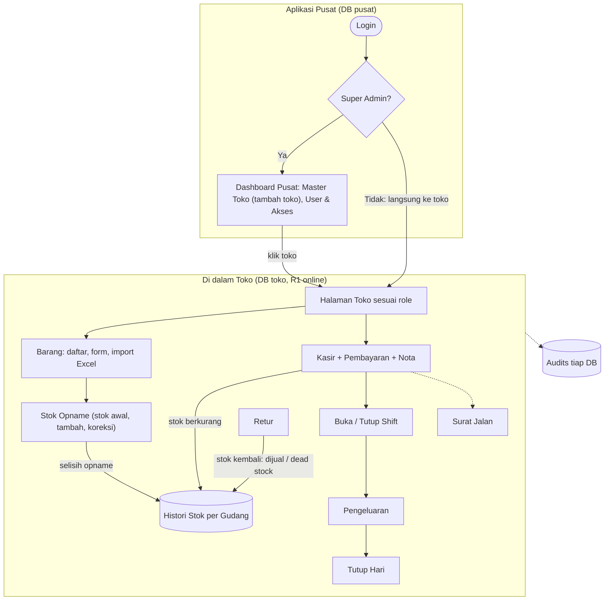
```mermaid
flowchart TB
    subgraph PUSAT["Aplikasi Pusat (DB pusat)"]
        P1(["Login"]) --> P2{"Super Admin?"}
        P2 -->|"Ya"| P3["Dashboard Pusat: Master Toko (tambah toko), User & Akses"]
    end
    subgraph TOKO["Di dalam Toko (DB toko, R1 online)"]
        T0["Halaman Toko sesuai role"]
        T1["Barang: daftar, form, import Excel"]
        T2["Stok Opname (stok awal, tambah, koreksi)"]
        T3["Kasir + Pembayaran + Nota"]
        T3b["Buka / Tutup Shift"]
        T4["Retur"]
        T5["Surat Jalan"]
        T6["Pengeluaran"]
        T7["Tutup Hari"]
        K[("Histori Stok per Gudang")]
        T1 --> T2
        T2 -->|"selisih opname"| K
        T3 -->|"stok berkurang"| K
        T4 -->|"stok kembali: dijual / dead stock"| K
        T3 --> T3b
        T3 -.-> T5
        T3b --> T6
        T6 --> T7
    end
    P2 -->|"Tidak: langsung ke toko"| T0
    P3 -->|"klik toko"| T0
    T0 --> T1
    T0 --> T3
    AUD[("Audits tiap DB")]
    TOKO -.-> AUD
```

> R2 menambah: Form Harga & histori, Pembelian, Penerimaan kontainer, FIFO, Transfer gudang, Cek stok lintas toko, Audit Trail (BPMN-3b, 4, 6, 12, 13, 14).

### 5.2 BPMN-1 — Setup Toko Baru

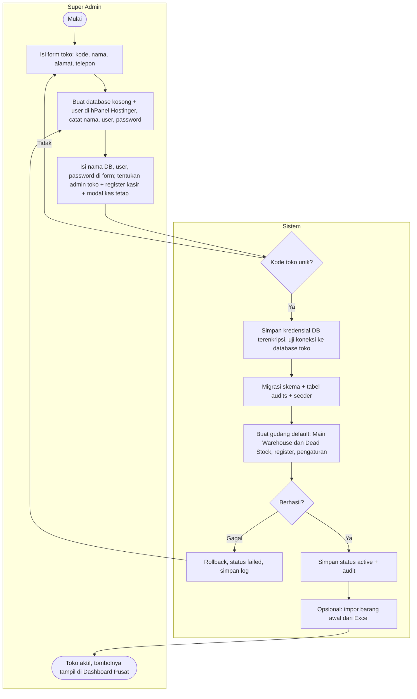
```mermaid
flowchart TD
    subgraph SA["Super Admin"]
        A1(["Mulai"]) --> A2["Isi form toko: kode, nama, alamat, telepon"]
        A2 --> A2b["Buat database kosong + user di hPanel Hostinger, catat nama, user, password"]
        A2b --> A3["Isi nama DB, user, password di form; tentukan admin toko + register kasir + modal kas tetap"]
        A9(["Toko aktif, tombolnya tampil di Dashboard Pusat"])
    end
    subgraph SYS["Sistem"]
        S1{"Kode toko unik?"}
        S2["Simpan kredensial DB terenkripsi, uji koneksi ke database toko"]
        S3["Migrasi skema + tabel audits + seeder"]
        S3b["Buat gudang default: Main Warehouse dan Dead Stock, register, pengaturan"]
        S4{"Berhasil?"}
        S5["Rollback, status failed, simpan log"]
        S6["Simpan status active + audit"]
        S7["Opsional: impor barang awal dari Excel"]
    end
    A3 --> S1
    S1 -->|"Tidak"| A2
    S1 -->|"Ya"| S2 --> S3 --> S3b --> S4
    S4 -->|"Gagal"| S5 --> A2b
    S4 -->|"Ya"| S6 --> S7 --> A9
```

### 5.3 BPMN-2 — Login & Routing per Role

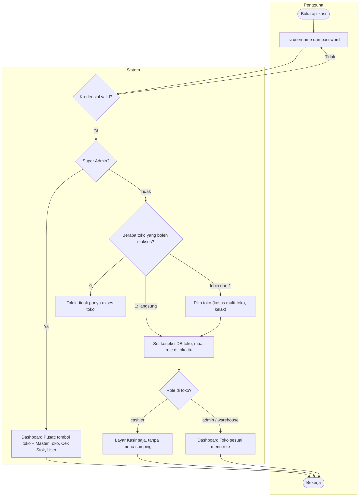
```mermaid
flowchart TD
    subgraph U["Pengguna"]
        U1(["Buka aplikasi"]) --> U2["Isi username dan password"]
        U9(["Bekerja"])
    end
    subgraph SYS["Sistem"]
        S1{"Kredensial valid?"}
        S2{"Super Admin?"}
        S3["Dashboard Pusat: tombol toko + Master Toko, Cek Stok, User"]
        S4{"Berapa toko yang boleh diakses?"}
        S5["Tolak: tidak punya akses toko"]
        S6["Pilih toko (kasus multi-toko, kelak)"]
        S7["Set koneksi DB toko, muat role di toko itu"]
        S8{"Role di toko?"}
        S9["Layar Kasir saja, tanpa menu samping"]
        S10["Dashboard Toko sesuai menu role"]
    end
    U2 --> S1
    S1 -->|"Tidak"| U2
    S1 -->|"Ya"| S2
    S2 -->|"Ya"| S3 --> U9
    S2 -->|"Tidak"| S4
    S4 -->|"0"| S5
    S4 -->|"1: langsung"| S7
    S4 -->|"lebih dari 1"| S6 --> S7
    S7 --> S8
    S8 -->|"cashier"| S9 --> U9
    S8 -->|"admin / warehouse"| S10 --> U9
```

### 5.4 BPMN-3 — Input / Ubah Barang (R1, sederhana)

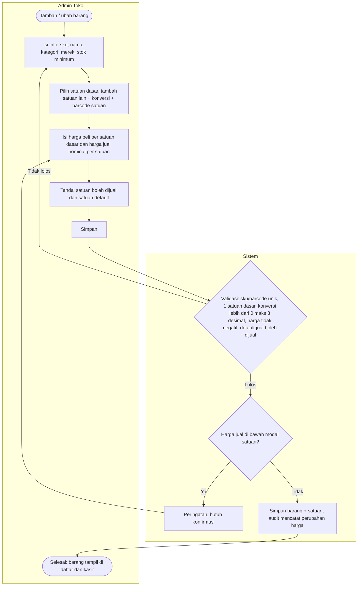
```mermaid
flowchart TD
    subgraph ADM["Admin Toko"]
        A1(["Tambah / ubah barang"]) --> A2["Isi info: sku, nama, kategori, merek, stok minimum"]
        A2 --> A3["Pilih satuan dasar, tambah satuan lain + konversi + barcode satuan"]
        A3 --> A4["Isi harga beli per satuan dasar dan harga jual nominal per satuan"]
        A4 --> A5["Tandai satuan boleh dijual dan satuan default"]
        A5 --> A6["Simpan"]
        A12(["Selesai: barang tampil di daftar dan kasir"])
    end
    subgraph SYS["Sistem"]
        S1{"Validasi: sku/barcode unik, 1 satuan dasar, konversi lebih dari 0 maks 3 desimal, harga tidak negatif, default jual boleh dijual"}
        S2{"Harga jual di bawah modal satuan?"}
        S3["Peringatan, butuh konfirmasi"]
        S4["Simpan barang + satuan, audit mencatat perubahan harga"]
    end
    A6 --> S1
    S1 -->|"Tidak lolos"| A2
    S1 -->|"Lolos"| S2
    S2 -->|"Ya"| S3 --> A4
    S2 -->|"Tidak"| S4 --> A12
```

### 5.4b BPMN-3b — Form Harga: Margin & Histori Harga (R2)

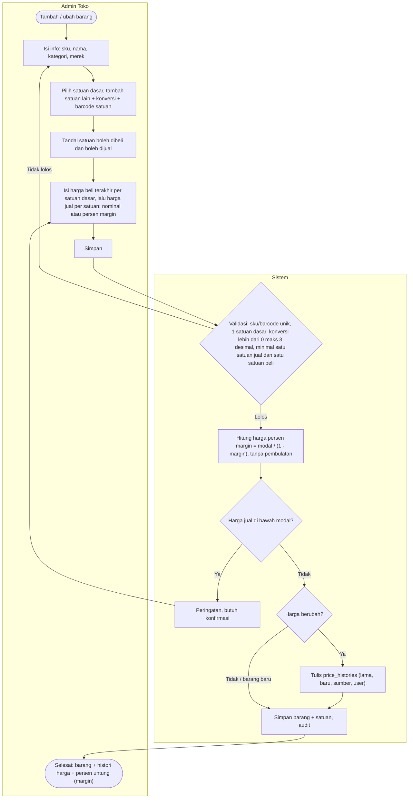
```mermaid
flowchart TD
    subgraph ADM["Admin Toko"]
        A1(["Tambah / ubah barang"]) --> A2["Isi info: sku, nama, kategori, merek"]
        A2 --> A3["Pilih satuan dasar, tambah satuan lain + konversi + barcode satuan"]
        A3 --> A4["Tandai satuan boleh dibeli dan boleh dijual"]
        A4 --> A5["Isi harga beli terakhir per satuan dasar, lalu harga jual per satuan: nominal atau persen margin"]
        A5 --> A6["Simpan"]
        A12(["Selesai: barang + histori harga + persen untung (margin)"])
    end
    subgraph SYS["Sistem"]
        S1{"Validasi: sku/barcode unik, 1 satuan dasar, konversi lebih dari 0 maks 3 desimal, minimal satu satuan jual dan satu satuan beli"}
        S4["Hitung harga persen margin = modal / (1 - margin), tanpa pembulatan"]
        S5{"Harga jual di bawah modal?"}
        S6["Peringatan, butuh konfirmasi"]
        S7{"Harga berubah?"}
        S8["Tulis price_histories (lama, baru, sumber, user)"]
        S9["Simpan barang + satuan, audit"]
    end
    A6 --> S1
    S1 -->|"Tidak lolos"| A2
    S1 -->|"Lolos"| S4 --> S5
    S5 -->|"Ya"| S6 --> A5
    S5 -->|"Tidak"| S7
    S7 -->|"Ya"| S8 --> S9
    S7 -->|"Tidak / barang baru"| S9
    S9 --> A12
```

### 5.5 BPMN-4 — Penerimaan Kontainer Multi-Supplier (R2)

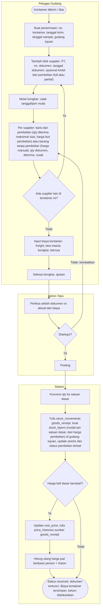
```mermaid
flowchart TD
    subgraph GD["Petugas Gudang"]
        G1(["Kontainer dikirim / tiba"]) --> G2["Buat penerimaan: no. kontainer, tanggal kirim, tanggal sampai, gudang tujuan"]
        G2 --> G3["Tambah blok supplier: PT, no. dokumen, tanggal dokumen; opsional Ambil dari pembelian (full atau partial)"]
        G3 --> G4["Mulai bongkar: catat tanggal/jam mulai"]
        G4 --> G5["Per supplier: baris dari pembelian (qty diterima maksimal sisa, harga ikut pembelian) atau barang tanpa pembelian (harga manual); qty dokumen, diterima, rusak"]
        G5 --> G6{"Ada supplier lain di kontainer ini?"}
        G6 -->|"Ya"| G3
        G6 -->|"Tidak"| G7["Input biaya kontainer: freight, bea masuk, bongkar, lainnya"]
        G7 --> G8["Selesai bongkar, ajukan"]
    end
    subgraph ADM["Admin Toko"]
        A1["Periksa selisih dokumen vs aktual dan biaya"]
        A2{"Disetujui?"}
        A3["Posting"]
    end
    subgraph SYS["Sistem"]
        S1["Konversi qty ke satuan dasar"]
        S2["Tulis stock_movements goods_receipt, buat stock_layers (modal per satuan dasar, dari harga pembelian) di gudang tujuan, update stocks dan status pembelian terkait"]
        S3{"Harga beli dasar berubah?"}
        S4["Update cost_price, tulis price_histories sumber goods_receipt"]
        S5["Hitung ulang harga jual berbasis persen + histori"]
        S6(["Status received, dokumen terkunci. Biaya kontainer tersimpan, belum dialokasikan"])
    end
    G8 --> A1 --> A2
    A2 -->|"Tidak: kembalikan"| G5
    A2 -->|"Ya"| A3 --> S1 --> S2 --> S3
    S3 -->|"Ya"| S4 --> S5 --> S6
    S3 -->|"Tidak"| S6
```

### 5.6 BPMN-5 — Stok Opname (per Gudang)

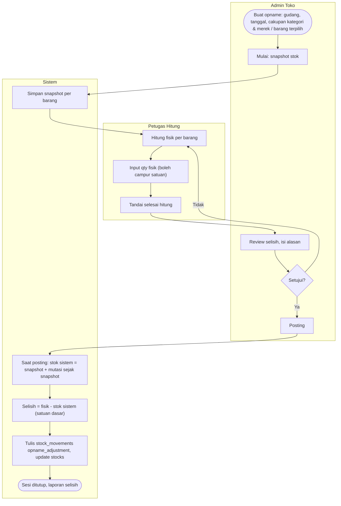
```mermaid
flowchart TD
    subgraph ADM["Admin Toko"]
        A1(["Buat opname: gudang, tanggal, cakupan kategori & merek / barang terpilih"]) --> A2["Mulai: snapshot stok"]
        A6["Review selisih, isi alasan"]
        A7{"Setujui?"}
        A8["Posting"]
    end
    subgraph PT["Petugas Hitung"]
        P1["Hitung fisik per barang"] --> P2["Input qty fisik (boleh campur satuan)"]
        P3["Tandai selesai hitung"]
    end
    subgraph SYS["Sistem"]
        S1["Simpan snapshot per barang"]
        S2["Saat posting: stok sistem = snapshot + mutasi sejak snapshot"]
        S3["Selisih = fisik - stok sistem (satuan dasar)"]
        S4["Tulis stock_movements opname_adjustment, update stocks"]
        S5(["Sesi ditutup, laporan selisih"])
    end
    A2 --> S1 --> P1
    P2 --> P3 --> A6 --> A7
    A7 -->|"Tidak"| P1
    A7 -->|"Ya"| A8 --> S2 --> S3 --> S4 --> S5
```

### 5.7 BPMN-6 — Transfer Antar-Gudang (Satu Toko) (R2)

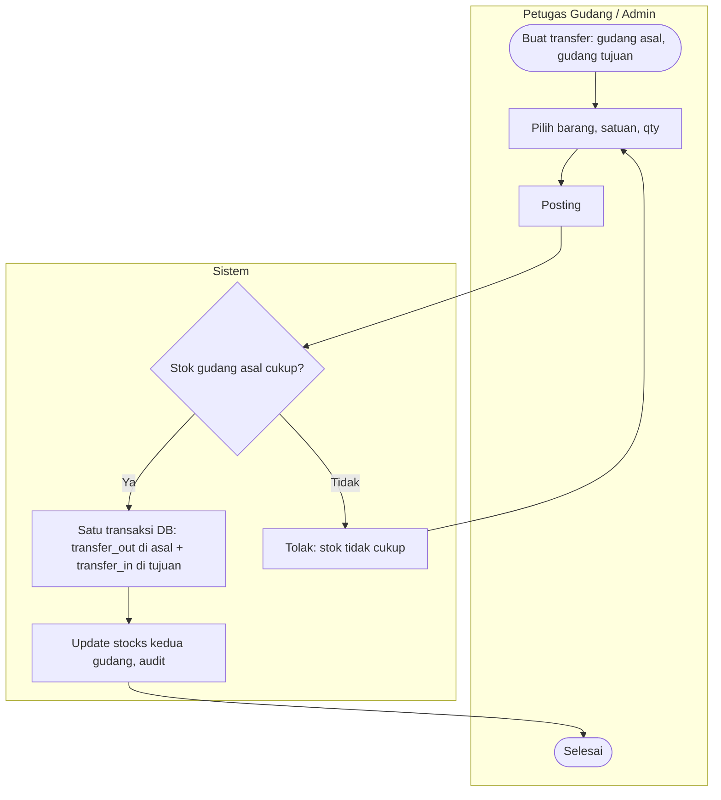
```mermaid
flowchart TD
    subgraph GD["Petugas Gudang / Admin"]
        G1(["Buat transfer: gudang asal, gudang tujuan"]) --> G2["Pilih barang, satuan, qty"]
        G2 --> G3["Posting"]
        G9(["Selesai"])
    end
    subgraph SYS["Sistem"]
        S1{"Stok gudang asal cukup?"}
        S2["Satu transaksi DB: transfer_out di asal + transfer_in di tujuan"]
        S3["Update stocks kedua gudang, audit"]
        S4["Tolak: stok tidak cukup"]
    end
    G3 --> S1
    S1 -->|"Tidak"| S4 --> G2
    S1 -->|"Ya"| S2 --> S3 --> G9
```

### 5.8 BPMN-7 — Penjualan Kasir (online)

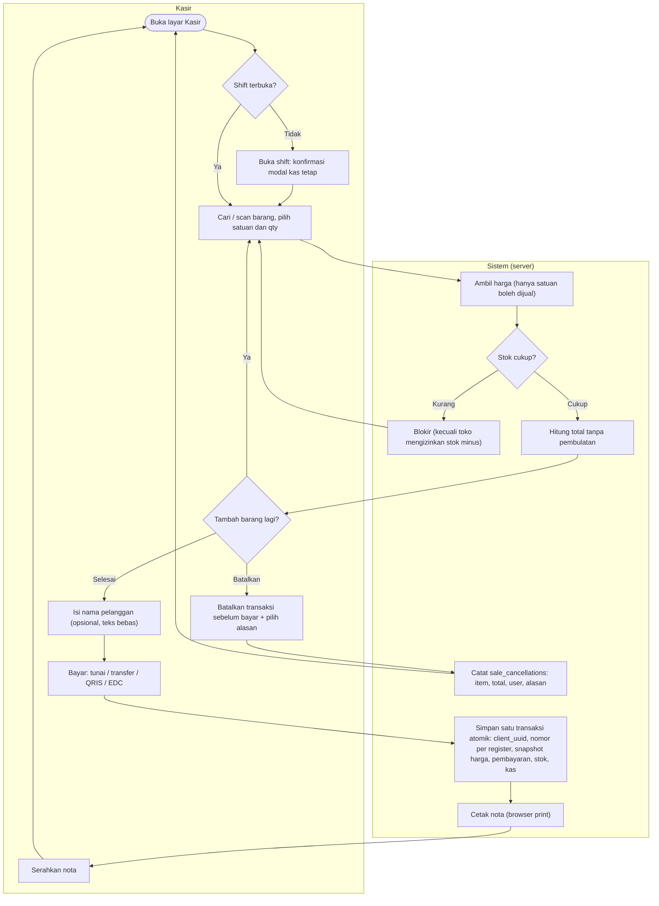
```mermaid
flowchart TD
    subgraph KS["Kasir"]
        K1(["Buka layar Kasir"]) --> K2{"Shift terbuka?"}
        K3["Buka shift: konfirmasi modal kas tetap"]
        K4["Cari / scan barang, pilih satuan dan qty"]
        K5{"Tambah barang lagi?"}
        K6["Isi nama pelanggan (opsional, teks bebas)"]
        K8["Bayar: tunai / transfer / QRIS / EDC"]
        K9["Batalkan transaksi sebelum bayar + pilih alasan"]
        K12["Serahkan nota"]
    end
    subgraph SYS["Sistem (server)"]
        D1["Ambil harga (hanya satuan boleh dijual)"]
        D2{"Stok cukup?"}
        D3["Blokir (kecuali toko mengizinkan stok minus)"]
        D4["Hitung total tanpa pembulatan"]
        D5["Simpan satu transaksi atomik: client_uuid, nomor per register, snapshot harga, pembayaran, stok, kas"]
        D6["Cetak nota (browser print)"]
        D10["Catat sale_cancellations: item, total, user, alasan"]
    end
    K2 -->|"Tidak"| K3 --> K4
    K2 -->|"Ya"| K4
    K4 --> D1 --> D2
    D2 -->|"Kurang"| D3 --> K4
    D2 -->|"Cukup"| D4 --> K5
    K5 -->|"Ya"| K4
    K5 -->|"Batalkan"| K9 --> D10 --> K1
    K5 -->|"Selesai"| K6 --> K8 --> D5 --> D6 --> K12 --> K1
```

### 5.9 BPMN-8 — dibatalkan (D34)

Sinkronisasi offline ke server **tidak dibangun** (sistem online only). Penomoran BPMN-9 dan seterusnya dipertahankan agar rujukan lama tetap sah.

### 5.10 BPMN-9 — Buka & Tutup Shift (2 Shift per Hari)

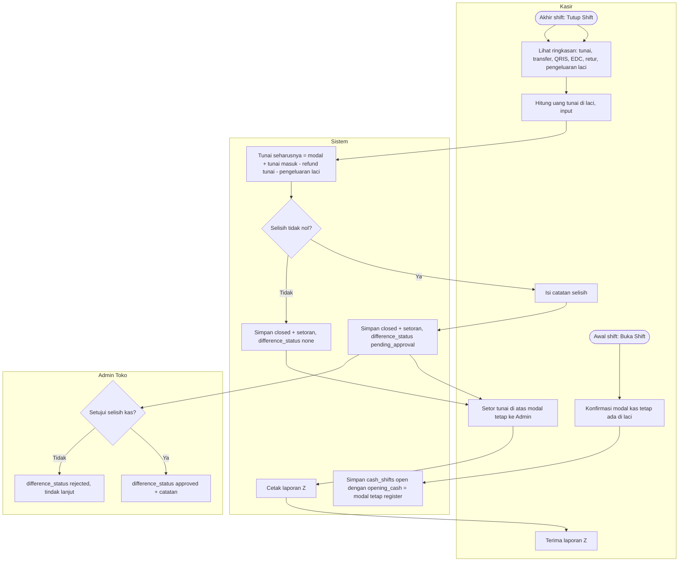
```mermaid
flowchart TD
    subgraph KS["Kasir"]
        K0(["Awal shift: Buka Shift"]) --> K0b["Konfirmasi modal kas tetap ada di laci"]
        K1(["Akhir shift: Tutup Shift"]) --> K2["Lihat ringkasan: tunai, transfer, QRIS, EDC, retur, pengeluaran laci"]
        K3["Hitung uang tunai di laci, input"]
        K5["Isi catatan selisih"]
        K7["Setor tunai di atas modal tetap ke Admin"]
        K8["Terima laporan Z"]
    end
    subgraph SYS["Sistem"]
        S0["Simpan cash_shifts open dengan opening_cash = modal tetap register"]
        S2["Tunai seharusnya = modal + tunai masuk - refund tunai - pengeluaran laci"]
        S3{"Selisih tidak nol?"}
        S4["Simpan closed + setoran, difference_status pending_approval"]
        S4b["Simpan closed + setoran, difference_status none"]
        S5["Cetak laporan Z"]
    end
    subgraph ADM["Admin Toko"]
        A1{"Setujui selisih kas?"}
        A2["difference_status approved + catatan"]
        A3["difference_status rejected, tindak lanjut"]
    end
    K0b --> S0
    K1 --> K2 --> K3 --> S2 --> S3
    S3 -->|"Ya"| K5 --> S4
    S3 -->|"Tidak"| S4b
    S4 --> K7
    S4b --> K7
    K7 --> S5 --> K8
    S4 --> A1
    A1 -->|"Ya"| A2
    A1 -->|"Tidak"| A3
```

### 5.11 BPMN-10 — Batal & Void Nota

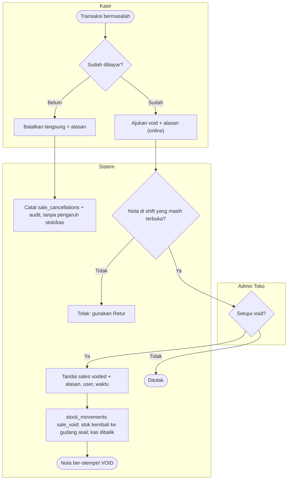
```mermaid
flowchart TD
    subgraph KS["Kasir"]
        K1(["Transaksi bermasalah"]) --> K2{"Sudah dibayar?"}
        K3["Batalkan langsung + alasan"]
        K4["Ajukan void + alasan (online)"]
    end
    subgraph ADM["Admin Toko"]
        A1{"Setujui void?"}
    end
    subgraph SYS["Sistem"]
        S1["Catat sale_cancellations + audit, tanpa pengaruh stok/kas"]
        S0{"Nota di shift yang masih terbuka?"}
        S0b["Tolak: gunakan Retur"]
        S2["Tandai sales voided + alasan, user, waktu"]
        S3["stock_movements sale_void: stok kembali ke gudang asal; kas dibalik"]
        S4(["Nota ber-stempel VOID"])
        S5(["Ditolak"])
    end
    K2 -->|"Belum"| K3 --> S1
    K2 -->|"Sudah"| K4 --> S0
    S0 -->|"Tidak"| S0b
    S0 -->|"Ya"| A1
    A1 -->|"Ya"| S2 --> S3 --> S4
    A1 -->|"Tidak"| S5
```

### 5.12 BPMN-11 — Retur: Refund / Tukar Barang & Disposisi Stok

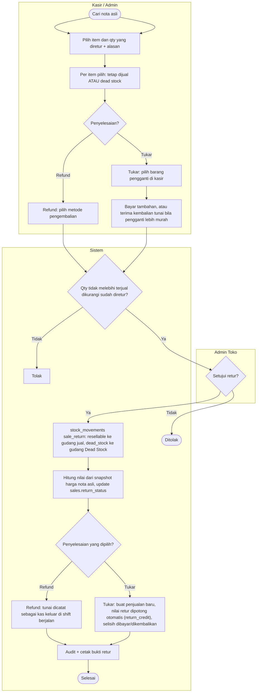
```mermaid
flowchart TD
    subgraph KS["Kasir / Admin"]
        R1(["Cari nota asli"]) --> R2["Pilih item dan qty yang diretur + alasan"]
        R3["Per item pilih: tetap dijual ATAU dead stock"]
        R4{"Penyelesaian?"}
        R5["Refund: pilih metode pengembalian"]
        R6["Tukar: pilih barang pengganti di kasir"]
        R7["Bayar tambahan, atau terima kembalian tunai bila pengganti lebih murah"]
    end
    subgraph ADM["Admin Toko"]
        A1{"Setujui retur?"}
    end
    subgraph SYS["Sistem"]
        S1{"Qty tidak melebihi terjual dikurangi sudah diretur?"}
        S2["Tolak"]
        S3["stock_movements sale_return: resellable ke gudang jual, dead_stock ke gudang Dead Stock"]
        S4["Hitung nilai dari snapshot harga nota asli, update sales.return_status"]
        S4d{"Penyelesaian yang dipilih?"}
        S5["Refund: tunai dicatat sebagai kas keluar di shift berjalan"]
        S6["Tukar: buat penjualan baru, nilai retur dipotong otomatis (return_credit), selisih dibayar/dikembalikan"]
        S7["Audit + cetak bukti retur"]
        S8(["Selesai"])
        S9(["Ditolak"])
    end
    R1 --> R2 --> R3 --> R4
    R4 -->|"Refund"| R5 --> S1
    R4 -->|"Tukar"| R6 --> R7 --> S1
    S1 -->|"Tidak"| S2
    S1 -->|"Ya"| A1
    A1 -->|"Tidak"| S9
    A1 -->|"Ya"| S3 --> S4 --> S4d
    S4d -->|"Refund"| S5
    S4d -->|"Tukar"| S6
    S5 --> S7
    S6 --> S7
    S7 --> S8
```

### 5.13 BPMN-12 — Pembelian dari Supplier & Penerimaan (Full / Partial) (R2)

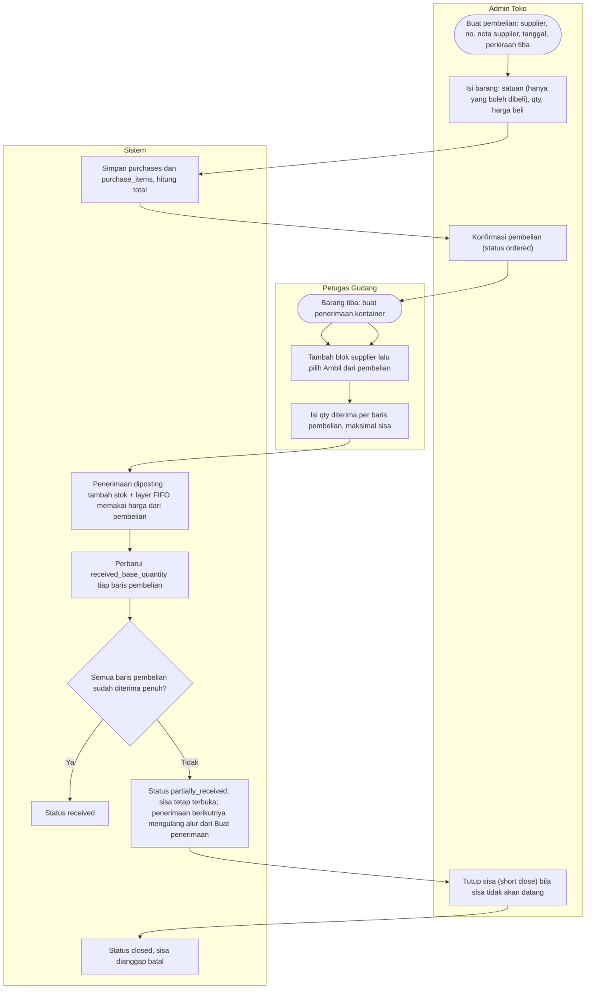
```mermaid
flowchart TD
    subgraph ADM["Admin Toko"]
        A1(["Buat pembelian: supplier, no. nota supplier, tanggal, perkiraan tiba"]) --> A2["Isi barang: satuan (hanya yang boleh dibeli), qty, harga beli"]
        A3["Konfirmasi pembelian (status ordered)"]
        A9["Tutup sisa (short close) bila sisa tidak akan datang"]
    end
    subgraph GD["Petugas Gudang"]
        G1(["Barang tiba: buat penerimaan kontainer"]) --> G2["Tambah blok supplier lalu pilih Ambil dari pembelian"]
        G3["Isi qty diterima per baris pembelian, maksimal sisa"]
    end
    subgraph SYS["Sistem"]
        S1["Simpan purchases dan purchase_items, hitung total"]
        S2["Penerimaan diposting: tambah stok + layer FIFO memakai harga dari pembelian"]
        S3["Perbarui received_base_quantity tiap baris pembelian"]
        S4{"Semua baris pembelian sudah diterima penuh?"}
        S5["Status received"]
        S6["Status partially_received, sisa tetap terbuka; penerimaan berikutnya mengulang alur dari Buat penerimaan"]
        S7["Status closed, sisa dianggap batal"]
    end
    A2 --> S1 --> A3
    A3 --> G1
    G1 --> G2 --> G3 --> S2 --> S3 --> S4
    S4 -->|"Ya"| S5
    S4 -->|"Tidak"| S6
    S6 --> A9 --> S7
```

### 5.14 BPMN-13 — Cek Stok Barang di Semua Toko (Master) (R2)

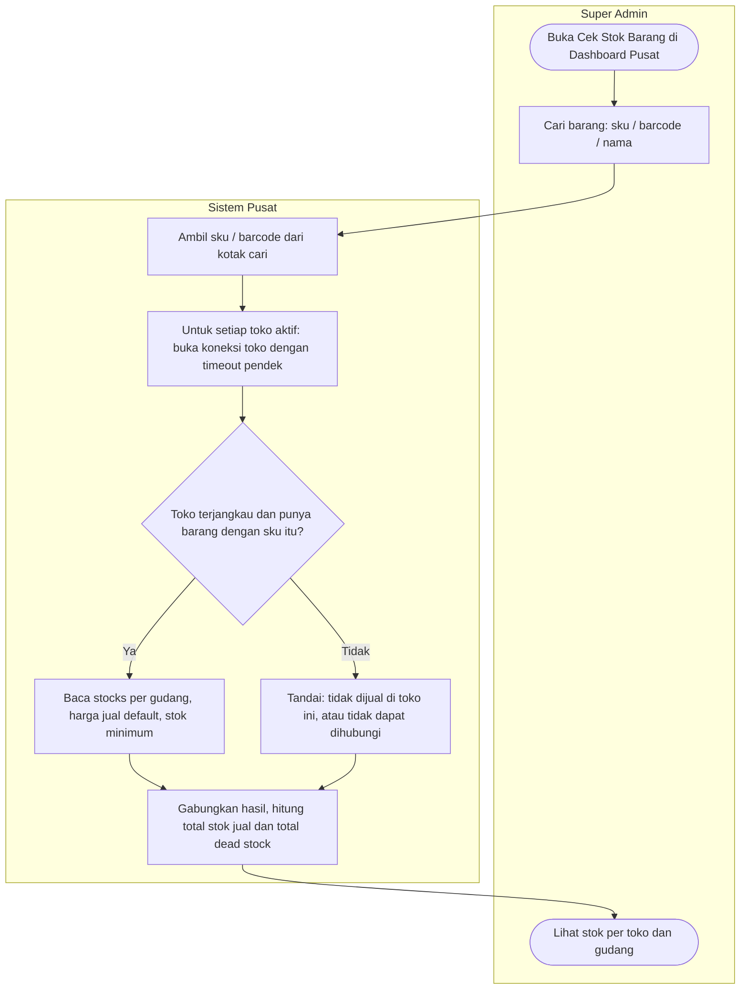
```mermaid
flowchart TD
    subgraph SA["Super Admin"]
        A1(["Buka Cek Stok Barang di Dashboard Pusat"]) --> A2["Cari barang: sku / barcode / nama"]
        A9(["Lihat stok per toko dan gudang"])
    end
    subgraph SYS["Sistem Pusat"]
        S1["Ambil sku / barcode dari kotak cari"]
        S2["Untuk setiap toko aktif: buka koneksi toko dengan timeout pendek"]
        S3{"Toko terjangkau dan punya barang dengan sku itu?"}
        S4["Baca stocks per gudang, harga jual default, stok minimum"]
        S5["Tandai: tidak dijual di toko ini, atau tidak dapat dihubungi"]
        S6["Gabungkan hasil, hitung total stok jual dan total dead stock"]
    end
    A2 --> S1 --> S2 --> S3
    S3 -->|"Ya"| S4 --> S6
    S3 -->|"Tidak"| S5 --> S6
    S6 --> A9
```

### 5.15 BPMN-14 — Costing FIFO: Layer Masuk, Keluar & Pembalikan (R2)

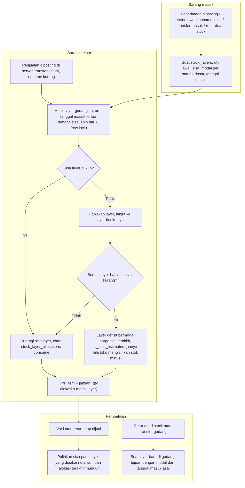
```mermaid
flowchart TD
    subgraph IN["Barang masuk"]
        I1["Penerimaan diposting / saldo awal / opname lebih / transfer masuk / retur dead stock"] --> I2["Buat stock_layers: qty awal, sisa, modal per satuan dasar, tanggal masuk"]
    end
    subgraph OUT["Barang keluar"]
        O1["Penjualan diposting di server, transfer keluar, opname kurang"] --> O2["Ambil layer gudang itu, urut tanggal masuk tertua dengan sisa lebih dari 0 (row lock)"]
        O2 --> O3{"Sisa layer cukup?"}
        O3 -->|"Ya"| O4["Kurangi sisa layer, catat stock_layer_allocations consume"]
        O3 -->|"Tidak"| O5["Habiskan layer, lanjut ke layer berikutnya"]
        O5 --> O7{"Semua layer habis, masih kurang?"}
        O7 -->|"Ya"| O8["Layer defisit bermodal harga beli terakhir, is_cost_estimated (hanya bila toko mengizinkan stok minus)"]
        O7 -->|"Tidak"| O4
        O4 --> O6["HPP item = jumlah (qty alokasi x modal layer)"]
        O8 --> O6
    end
    subgraph REV["Pembalikan"]
        R1["Void atau retur tetap dijual"] --> R2["Pulihkan sisa pada layer yang dipakai nota asli, dari alokasi terakhir mundur"]
        R3["Retur dead stock atau transfer gudang"] --> R4["Buat layer baru di gudang tujuan dengan modal dan tanggal masuk asal"]
    end
    I2 --> O2
    O6 --> R1
```

### 5.16 BPMN-15 — Surat Jalan (Pengantaran Barang)

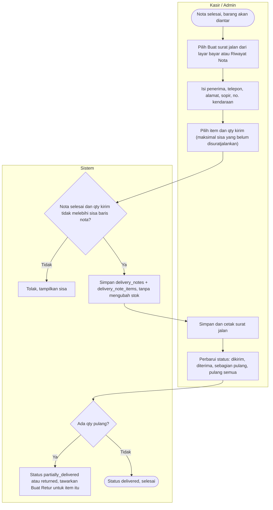
```mermaid
flowchart TD
    subgraph KS["Kasir / Admin"]
        K1(["Nota selesai, barang akan diantar"]) --> K2["Pilih Buat surat jalan dari layar bayar atau Riwayat Nota"]
        K2 --> K3["Isi penerima, telepon, alamat, sopir, no. kendaraan"]
        K3 --> K4["Pilih item dan qty kirim (maksimal sisa yang belum disuratjalankan)"]
        K5["Simpan dan cetak surat jalan"]
        K6["Perbarui status: dikirim, diterima, sebagian pulang, pulang semua"]
    end
    subgraph SYS["Sistem"]
        S1{"Nota selesai dan qty kirim tidak melebihi sisa baris nota?"}
        S2["Tolak, tampilkan sisa"]
        S3["Simpan delivery_notes + delivery_note_items, tanpa mengubah stok"]
        S4{"Ada qty pulang?"}
        S5["Status partially_delivered atau returned, tawarkan Buat Retur untuk item itu"]
        S6(["Status delivered, selesai"])
    end
    K4 --> S1
    S1 -->|"Tidak"| S2
    S1 -->|"Ya"| S3 --> K5 --> K6 --> S4
    S4 -->|"Ya"| S5
    S4 -->|"Tidak"| S6
```

### 5.17 BPMN-16 — Pengeluaran

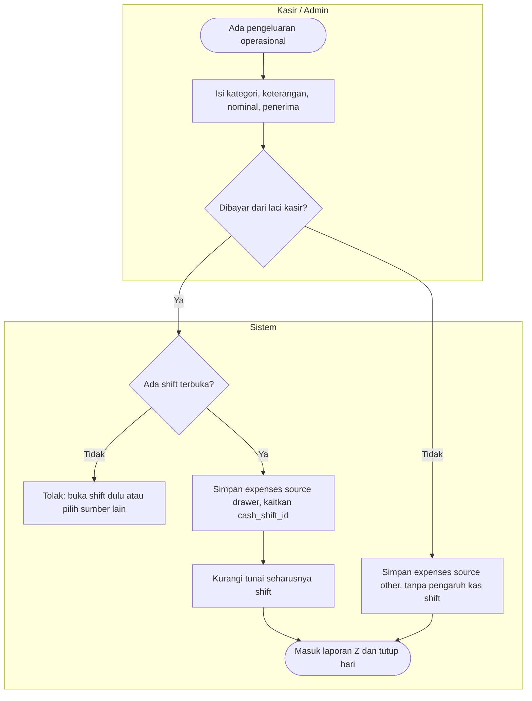
```mermaid
flowchart TD
    subgraph U["Kasir / Admin"]
        U1(["Ada pengeluaran operasional"]) --> U2["Isi kategori, keterangan, nominal, penerima"]
        U2 --> U3{"Dibayar dari laci kasir?"}
    end
    subgraph SYS["Sistem"]
        S1{"Ada shift terbuka?"}
        S2["Tolak: buka shift dulu atau pilih sumber lain"]
        S3["Simpan expenses source drawer, kaitkan cash_shift_id"]
        S4["Kurangi tunai seharusnya shift"]
        S5["Simpan expenses source other, tanpa pengaruh kas shift"]
        S6(["Masuk laporan Z dan tutup hari"])
    end
    U3 -->|"Ya"| S1
    U3 -->|"Tidak"| S5
    S1 -->|"Tidak"| S2
    S1 -->|"Ya"| S3 --> S4 --> S6
    S5 --> S6
```

### 5.18 BPMN-17 — Tutup Hari

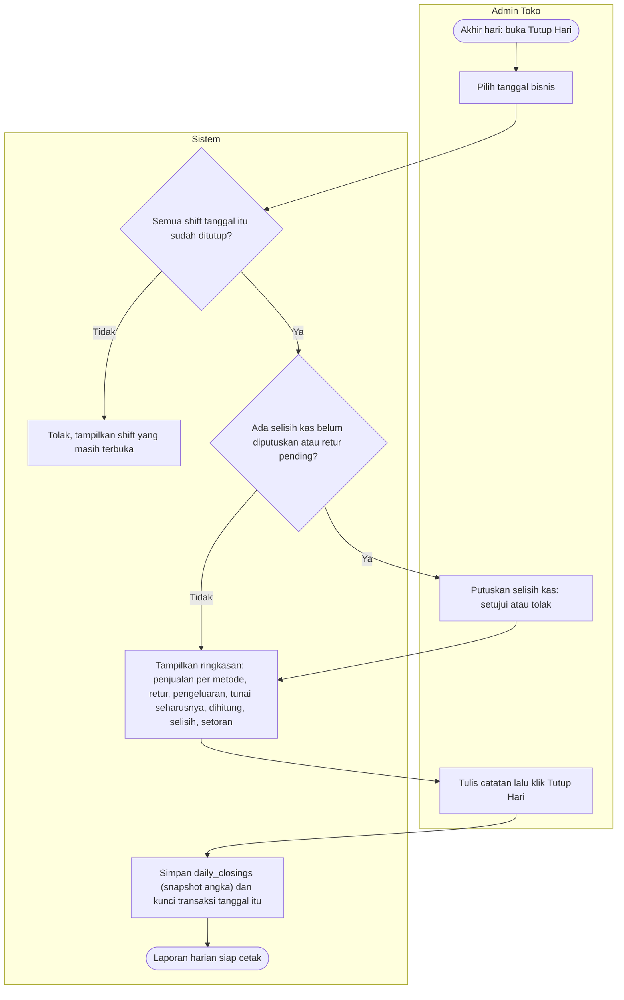
```mermaid
flowchart TD
    subgraph ADM["Admin Toko"]
        A1(["Akhir hari: buka Tutup Hari"]) --> A2["Pilih tanggal bisnis"]
        A5["Putuskan selisih kas: setujui atau tolak"]
        A7["Tulis catatan lalu klik Tutup Hari"]
    end
    subgraph SYS["Sistem"]
        S1{"Semua shift tanggal itu sudah ditutup?"}
        S2["Tolak, tampilkan shift yang masih terbuka"]
        S3{"Ada selisih kas belum diputuskan atau retur pending?"}
        S4["Tampilkan ringkasan: penjualan per metode, retur, pengeluaran, tunai seharusnya, dihitung, selisih, setoran"]
        S6["Simpan daily_closings (snapshot angka) dan kunci transaksi tanggal itu"]
        S8(["Laporan harian siap cetak"])
    end
    A2 --> S1
    S1 -->|"Tidak"| S2
    S1 -->|"Ya"| S3
    S3 -->|"Ya"| A5 --> S4
    S3 -->|"Tidak"| S4
    S4 --> A7 --> S6 --> S8
```

---

## 6. ERD (nama tabel & kolom Inggris, jamak)

### 6.1 DB Pusat (1 database)

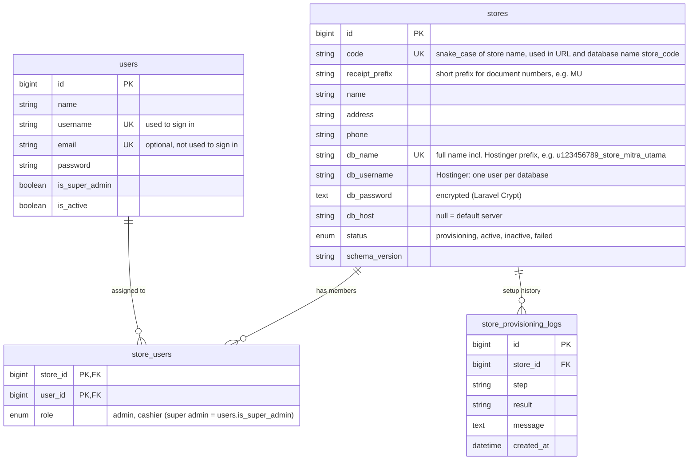
```mermaid
erDiagram
    users ||--o{ store_users : "assigned to"
    stores ||--o{ store_users : "has members"
    stores ||--o{ store_provisioning_logs : "setup history"

    users {
        bigint id PK
        string name
        string username UK "used to sign in"
        string email UK "optional, not used to sign in"
        string password
        boolean is_super_admin
        boolean is_active
    }
    stores {
        bigint id PK
        string code UK "snake_case of store name, used in URL and database name store_code"
        string receipt_prefix "short prefix for document numbers, e.g. MU"
        string name
        string address
        string phone
        string db_name UK "full name incl. Hostinger prefix, e.g. u123456789_store_mitra_utama"
        string db_username "Hostinger: one user per database"
        text db_password "encrypted (Laravel Crypt)"
        string db_host "null = default server"
        enum status "provisioning, active, inactive, failed"
        string schema_version
    }
    store_users {
        bigint store_id PK, FK
        bigint user_id PK, FK
        enum role "admin, cashier (super admin = users.is_super_admin)"
    }
    store_provisioning_logs {
        bigint id PK
        bigint store_id FK
        string step
        string result
        text message
        datetime created_at
    }
```

> DB pusat hanya memuat toko, user, dan akses (tidak ada katalog barang, D27). Tabel `audits` (paket Laravel Auditing) ada di DB pusat dan setiap DB toko; tidak digambar.

### 6.2 DB Toko — a. Master barang & harga (milik toko)

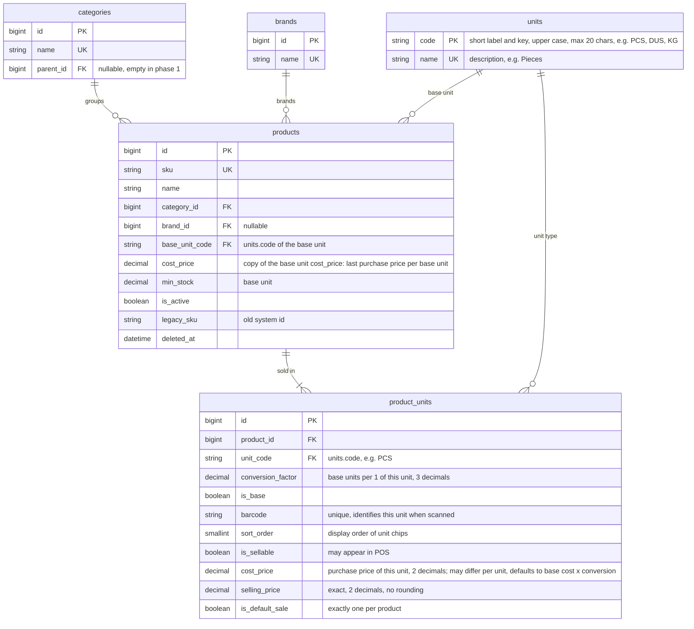
```mermaid
erDiagram
    categories ||--o{ products : "groups"
    brands ||--o{ products : "brands"
    units ||--o{ products : "base unit"
    products ||--|{ product_units : "sold in"
    units ||--o{ product_units : "unit type"

    products {
        bigint id PK
        string sku UK
        string name
        bigint category_id FK
        bigint brand_id FK "nullable"
        string base_unit_code FK "units.code of the base unit"
        decimal cost_price "copy of the base unit cost_price: last purchase price per base unit"
        decimal min_stock "base unit"
        boolean is_active
        string legacy_sku "old system id"
        datetime deleted_at
    }
    product_units {
        bigint id PK
        bigint product_id FK
        string unit_code FK "units.code, e.g. PCS"
        decimal conversion_factor "base units per 1 of this unit, 3 decimals"
        boolean is_base
        string barcode "unique, identifies this unit when scanned"
        smallint sort_order "display order of unit chips"
        boolean is_sellable "may appear in POS"
        decimal cost_price "purchase price of this unit, 2 decimals; may differ per unit, defaults to base cost x conversion"
        decimal selling_price "exact, 2 decimals, no rounding"
        boolean is_default_sale "exactly one per product"
    }
    categories {
        bigint id PK
        string name UK
        bigint parent_id FK "nullable, empty in phase 1"
    }
    brands {
        bigint id PK
        string name UK
    }
    units {
        string code PK "short label and key, upper case, max 20 chars, e.g. PCS, DUS, KG"
        string name UK "description, e.g. Pieces"
    }
```

### 6.2r DB Toko — a2. Harga lanjutan: margin & histori (R2)

> Penambahan di atas tabel R1: tiga kolom baru di `product_units` dan tabel `price_histories`. Di R1 perubahan harga hanya tercatat di `audits` dan menjadi sumber backfill histori.

```mermaid
erDiagram
    products ||--o{ price_histories : "price changes"
    product_units ||--o{ price_histories : "selling price of"

    product_units {
        enum price_mode "nominal, margin"
        decimal margin_percent "of selling price, below 100"
        boolean is_purchasable "may appear in goods receipts"
    }
    price_histories {
        bigint id PK
        bigint product_id FK
        bigint product_unit_id FK "null for purchase price"
        enum type "purchase, selling"
        decimal old_value
        decimal new_value
        enum new_mode "nominal, margin"
        decimal new_margin_percent
        enum source "manual, goods_receipt, recalculation, import, migration"
        string reference_type
        bigint reference_id
        bigint user_id "no FK, other database"
        string user_name
        string note
        datetime created_at
    }
```

### 6.2a Skema Barang — ringkasan untuk persetujuan

**Tabel (semua di DB toko)**
| Tabel | Kolom penting | Kendala utama |
|---|---|---|
| `categories` | `name`, `parent_id` (kosong di Fase 1, kategori datar) | `name` unik |
| `brands` | `name` | `name` unik |
| `units` | `code` (**kunci**: label pendek huruf besar, mis. PCS, DUS, KG; tampil di layar dan nota), `name` (keterangan, mis. Pieces) | `code` kunci utama, `name` unik; mengganti `code` merambat ke `products` dan `product_units`; satuan yang sedang dipakai tidak bisa dihapus |
| `products` | `sku`, `name`, `category_id` (wajib), `brand_id` (boleh kosong), `base_unit_code`, `cost_price` (salinan modal satuan dasar), `min_stock`, `is_active`, `legacy_sku` | `sku` unik per toko |
| `product_units` | `unit_code`, `conversion_factor`, `is_base`, `barcode`, `sort_order`, `is_purchasable`, `is_sellable`, `cost_price` (modal satuan ini), `price_mode`, `margin_percent`, `selling_price`, `is_default_sale` | satu baris per barang × satuan |
| `price_histories` **(R2)** | harga lama → baru, mode, sumber, user | append-only |

**Kendala integritas**
1. Tepat **satu satuan dasar** per barang, `conversion_factor = 1`; `unique(product_id, unit_code)`; satuan dasar sama dengan `products.base_unit_code`.
2. `conversion_factor` > 0, maks **3 desimal**; semua satuan boleh berdesimal (kuantitas maks 3 desimal).
3. **Barcode hanya di satuan** (`product_units.barcode`), unik per DB (boleh kosong). Scan barcode = menentukan barang **dan** satuannya.
4. Tepat satu `is_default_sale` per barang, dan satuan itu harus `is_sellable`; minimal satu satuan `is_sellable` dan satu `is_purchasable`.
5. `price_mode = nominal` → `margin_percent` kosong; `price_mode = margin` → 0 ≤ `margin_percent` < 100 dan `selling_price = modal_satuan / (1 − margin%/100)`; `selling_price` ≥ 0, 2 desimal, tanpa pembulatan.
6. Barang tidak aktif tidak muncul di kasir/penerimaan, tetap muncul di laporan & histori stok.
7. Konversi dan satuan terkunci setelah ada stok/transaksi; barang bertransaksi tidak dapat dihapus; setiap perubahan harga menulis `price_histories`.

**Penyesuaian dari tinjauan ulang**
| # | Perubahan | Alasan |
|---|---|---|
| a | Barcode hanya di `product_units` (tidak ada di `products`) | Scan harus menentukan satuan |
| b | **Tanpa katalog pusat (v0.6)**: tidak ada `uuid`, `is_catalog_active`, `version`, `product_store_units`, `product_store_assignments` | Master cukup per toko (D27); lebih sederhana |
| c | `product_units.is_active` dihapus | Redundan dengan `is_purchasable`/`is_sellable` |
| d | `conversion_factor` `decimal(15,3)` | Presisi sama dengan kuantitas stok |
| e | `product_units.sort_order` | Urutan chip satuan di kasir konsisten |

**Sengaja tidak ada di Fase 1:** katalog bersama antar-toko, harga bertingkat berdasarkan jumlah (grosir), banyak barcode per satuan, kategori bertingkat, varian (warna/ukuran) sebagai barang terpisah, foto barang.

### 6.3 DB Toko — b. Gudang & stok

```mermaid
erDiagram
    warehouses ||--o{ stocks : "holds"
    products ||--o{ stocks : "stocked as"
    warehouses ||--o{ stock_movements : "moves in"
    products ||--o{ stock_movements : "ledger"

    warehouses {
        bigint id PK
        string code UK
        string name
        enum type "sellable, dead_stock"
        boolean is_default
        boolean is_active
    }
    stocks {
        bigint product_id PK, FK
        bigint warehouse_id PK, FK
        decimal quantity "base unit, cache of ledger"
        datetime updated_at
    }
    stock_movements {
        bigint id PK
        bigint product_id FK
        bigint warehouse_id FK
        datetime moved_at
        enum type "opening_balance, sale, sale_void, sale_return, opname_adjustment"
        decimal quantity "signed base unit"
        decimal balance_after
        string reference_type
        bigint reference_id
        bigint user_id
        string note
    }
```

### 6.3r DB Toko — b1. Transfer gudang (R2)

> Penambahan: dokumen transfer antar-gudang dan jenis mutasi stok baru. `stocks` dan `stock_movements` R1 tidak berubah strukturnya.

```mermaid
erDiagram
    warehouses ||--o{ stock_transfers : "source"
    warehouses ||--o{ stock_transfers : "destination"
    stock_transfers ||--|{ stock_transfer_items : "contains"
    products ||--o{ stock_transfer_items : ""

    stock_movements {
        enum type "adds: goods_receipt, goods_receipt_cancel, transfer_out, transfer_in"
    }
    stock_transfers {
        bigint id PK
        string number UK
        bigint source_warehouse_id FK
        bigint destination_warehouse_id FK
        enum status "draft, posted, cancelled"
        datetime transferred_at
        bigint created_by
        text notes
    }
    stock_transfer_items {
        bigint id PK
        bigint stock_transfer_id FK
        bigint product_id FK
        bigint product_unit_id FK
        decimal quantity
        decimal conversion_snapshot
        decimal base_quantity
    }
```

### 6.3b DB Toko — b2. Layer modal FIFO (R2)

```mermaid
erDiagram
    warehouses ||--o{ stock_layers : "holds"
    products ||--o{ stock_layers : "costed in"
    stock_layers ||--o{ stock_layer_allocations : "consumed or restored by"

    stock_layers {
        bigint id PK
        bigint product_id FK
        bigint warehouse_id FK
        enum source "goods_receipt, opening_balance, transfer_in, sale_return, opname_gain, deficit"
        string reference_type
        bigint reference_id
        datetime entered_at "FIFO order key, preserved when moved between warehouses"
        decimal original_quantity "base unit"
        decimal remaining_quantity "base unit, negative only for deficit layer"
        decimal unit_cost "per base unit"
        boolean is_cost_estimated
        datetime created_at
    }
    stock_layer_allocations {
        bigint id PK
        bigint stock_layer_id FK
        enum direction "consume, restore"
        string reference_type "sale_item, sale_return_item, transfer_item, opname_item"
        bigint reference_id
        decimal base_quantity
        decimal unit_cost
        datetime created_at
    }
```

> Invarian: per produk × gudang, `stocks.quantity = Σ stock_layers.remaining_quantity = Σ stock_movements.quantity`. `stock_movements` = ledger kuantitas; `stock_layers` + `stock_layer_allocations` = ledger biaya.

### 6.4 DB Toko — c. Stok opname

```mermaid
erDiagram
    warehouses ||--o{ stock_opnames : "counted in"
    stock_opnames ||--|{ stock_opname_items : "contains"
    products ||--o{ stock_opname_items : ""

    stock_opnames {
        bigint id PK
        string number UK
        bigint warehouse_id FK
        date opname_date
        enum scope "category, selected"
        bigint category_id FK
        bigint brand_id FK
        enum status "draft, counting, review, posted, cancelled"
        datetime deleted_at "soft delete, set when cancelled"
        datetime snapshot_at
        string reason_code "e.g. inter_store_transfer, opening_balance"
        bigint created_by
        bigint approved_by
        datetime posted_at
    }
    stock_opname_items {
        bigint id PK
        bigint stock_opname_id FK
        bigint product_id FK
        decimal snapshot_quantity
        decimal counted_quantity
        decimal system_quantity_at_posting
        decimal variance
        string reason
    }
```

### 6.4r DB Toko — c2. Pembelian & penerimaan kontainer (R2)

> Tabel baru R2: pemasok, pembelian, dan penerimaan kontainer (multi-supplier, biaya kontainer). Penerimaan merujuk baris pembelian (penuh atau sebagian).

```mermaid
erDiagram
    suppliers ||--o{ purchases : "supplies"
    purchases ||--|{ purchase_items : "lines"
    products ||--o{ purchase_items : ""
    product_units ||--o{ purchase_items : "purchase unit"
    purchase_items ||--o{ goods_receipt_items : "received by"
    warehouses ||--o{ goods_receipts : "destination"
    goods_receipts ||--|{ goods_receipt_suppliers : "supplier sections"
    suppliers ||--o{ goods_receipt_suppliers : "ships"
    goods_receipt_suppliers ||--|{ goods_receipt_items : "items"
    products ||--o{ goods_receipt_items : ""
    product_units ||--o{ goods_receipt_items : "input unit"
    goods_receipts ||--o{ goods_receipt_costs : "container costs"

    suppliers {
        bigint id PK
        string name
        string phone
        boolean is_active
    }
    purchases {
        bigint id PK
        string number UK "PB/MU/2610/0001"
        bigint supplier_id FK
        string supplier_document_number "invoice or order number from supplier"
        date purchase_date
        date expected_date "ETA"
        bigint warehouse_id FK "default destination"
        enum status "draft, ordered, partially_received, received, closed, cancelled"
        decimal total_amount
        text notes
        bigint created_by
        bigint confirmed_by
        datetime confirmed_at
        string cancel_reason
    }
    purchase_items {
        bigint id PK
        bigint purchase_id FK
        bigint product_id FK
        bigint product_unit_id FK "must be purchasable"
        decimal quantity "ordered, in purchase unit"
        decimal conversion_snapshot
        decimal base_quantity
        decimal unit_cost
        decimal base_unit_cost
        decimal subtotal
        decimal received_base_quantity "cache, from posted receipts"
        string notes
    }
    goods_receipts {
        bigint id PK
        string number UK
        string container_number
        date shipped_date
        date arrival_date
        datetime unloading_started_at
        datetime unloading_finished_at
        bigint warehouse_id FK
        enum status "draft, unloading, submitted, received, cancelled"
        text notes
        bigint created_by
        bigint approved_by
        datetime posted_at
        string cancel_reason
    }
    goods_receipt_suppliers {
        bigint id PK
        bigint goods_receipt_id FK
        bigint supplier_id FK
        string document_number "invoice or packing list"
        date document_date
        text notes
    }
    goods_receipt_items {
        bigint id PK
        bigint goods_receipt_supplier_id FK
        bigint purchase_item_id FK "optional: receipt against a purchase line, full or partial"
        bigint product_id FK
        bigint product_unit_id FK
        decimal document_quantity
        decimal received_quantity "good condition"
        decimal damaged_quantity "info only, not stocked"
        decimal conversion_snapshot
        decimal base_quantity
        decimal unit_cost "copied from purchase item when linked, manual otherwise"
        decimal base_unit_cost
        decimal subtotal
    }
    goods_receipt_costs {
        bigint id PK
        bigint goods_receipt_id FK
        enum cost_type "freight, customs, handling, other"
        string description
        string vendor_name
        decimal amount
        date paid_date
        boolean is_allocated "reserved, false until landed cost is built"
    }
```

### 6.5 DB Toko — d. Penjualan, pembatalan & retur

```mermaid
erDiagram
    registers ||--o{ sales : "rings up"
    cash_shifts ||--o{ sales : "contains"
    warehouses ||--o{ registers : "sells from"
    sales ||--|{ sale_items : "lines"
    sales ||--|{ sale_payments : "paid by"
    products ||--o{ sale_items : ""
    product_units ||--o{ sale_items : ""
    cash_shifts ||--o{ sale_cancellations : "logged in"
    sales ||--o{ sale_returns : "returned via"
    sale_returns ||--|{ sale_return_items : "lines"
    sale_items ||--o{ sale_return_items : "returns"
    warehouses ||--o{ sale_return_items : "restocked to"
    sales ||--o| sale_returns : "exchange sale"

    sales {
        bigint id PK
        uuid client_uuid UK "idempotency key"
        string number UK "INV/PREFIX/REGISTER/YYMM/0001"
        bigint register_id FK
        bigint cash_shift_id FK
        bigint warehouse_id FK
        datetime sold_at "client time"
        date business_date "operational date, from the shift"
        bigint cashier_id
        string cashier_name
        string customer_name "optional free text, e.g. buyer name on receipt"
        decimal subtotal
        decimal discount_total "reserved, 0 in phase 1"
        decimal total
        decimal paid_total
        decimal change_amount
        enum status "completed, voided"
        enum return_status "none, partial, full"
        string void_reason
        bigint voided_by
        datetime voided_at
        int print_count
        string legacy_number "old system id"
        decimal legacy_unpaid_amount "info only: old credit balance, no receivable module in phase 1"
        boolean is_price_estimated "migrated rows"
    }
    sale_items {
        bigint id PK
        bigint sale_id FK
        bigint product_id FK
        bigint product_unit_id FK
        string product_name "snapshot"
        string unit_name "snapshot"
        decimal quantity
        decimal conversion_snapshot
        decimal base_quantity
        decimal unit_price "price at sale time"
        decimal cost_total "FIFO cost of consumed layers, set on posting"
        boolean is_cost_estimated "migrated rows or deficit layer"
        boolean is_manual_price
        decimal subtotal
    }
    sale_payments {
        bigint id PK
        bigint sale_id FK
        enum method "cash, transfer, qris, edc, return_credit"
        decimal amount
        string reference
    }
    sale_cancellations {
        bigint id PK
        uuid client_uuid UK
        bigint register_id FK
        bigint cash_shift_id FK
        bigint cashier_id
        string cashier_name
        datetime cancelled_at
        int item_count
        decimal total
        string reason
        json items_snapshot
    }
    sale_returns {
        bigint id PK
        string number UK
        bigint sale_id FK
        bigint register_id FK
        bigint cash_shift_id FK
        datetime returned_at
        enum resolution "refund, exchange"
        enum refund_method "cash, transfer, qris, edc"
        decimal credit_amount "value of returned items"
        decimal refund_amount "paid back to customer"
        bigint exchange_sale_id FK
        enum status "pending, completed, rejected"
        string reason
        bigint requested_by
        bigint approved_by
    }
    sale_return_items {
        bigint id PK
        bigint sale_return_id FK
        bigint sale_item_id FK
        bigint product_id FK
        bigint product_unit_id FK
        decimal quantity
        decimal base_quantity
        decimal unit_price "from original sale"
        decimal cost_total "cost of restored layers"
        decimal refund_subtotal
        enum disposition "resellable, dead_stock"
        bigint destination_warehouse_id FK
        string condition_note
    }
```

### 6.5b DB Toko — d2. Surat jalan

```mermaid
erDiagram
    sales ||--o{ delivery_notes : "delivered via"
    delivery_notes ||--|{ delivery_note_items : "lines"
    sale_items ||--o{ delivery_note_items : "delivered as"

    delivery_notes {
        bigint id PK
        string number UK "SJ/MU/2610/0001"
        bigint sale_id FK
        date business_date
        enum status "draft, shipped, delivered, partially_delivered, returned, cancelled"
        string recipient_name
        string recipient_phone
        text recipient_address
        string driver_name
        string vehicle_number
        datetime shipped_at
        datetime completed_at
        text notes
        int print_count
        bigint created_by
        string created_by_name
    }
    delivery_note_items {
        bigint id PK
        bigint delivery_note_id FK
        bigint sale_item_id FK
        bigint product_id FK
        bigint product_unit_id FK
        string product_name "snapshot"
        string unit_name "snapshot"
        decimal quantity "to deliver, sale unit"
        decimal quantity_delivered
        decimal quantity_returned "info only, stock restored via sale return"
    }
```

> Surat jalan **tidak menulis** `stock_movements`: stok sudah berkurang saat nota. `quantity_returned` hanya penanda; barang kembali ke stok lewat **Retur** nota.

### 6.6 DB Toko — e. Shift, pengeluaran & tutup hari

```mermaid
erDiagram
    registers ||--o{ cash_shifts : "opens"
    cash_shifts ||--o{ expenses : "drawer expenses"
    expense_categories ||--o{ expenses : "classifies"

    registers {
        bigint id PK
        string code UK "used in receipt number"
        string name
        bigint warehouse_id FK
        decimal fixed_opening_cash "modal kas tetap"
        int last_sale_sequence "server mirror"
        boolean is_active
    }
    cash_shifts {
        bigint id PK
        uuid client_uuid UK
        bigint register_id FK
        date business_date "date the shift was opened"
        bigint cashier_id "no FK, other database"
        string cashier_name
        datetime opened_at
        decimal opening_cash "= fixed_opening_cash"
        datetime closed_at
        decimal expected_cash "opening + cash sales - cash refunds - drawer expenses"
        decimal counted_cash
        decimal cash_difference
        decimal deposit_amount "counted cash above fixed float"
        enum status "open, closed"
        enum difference_status "none, pending_approval, approved, rejected"
        bigint difference_approved_by
        datetime difference_approved_at
        text closing_note
        text approval_note
    }
    expense_categories {
        bigint id PK
        string name UK
        boolean is_active
    }
    expenses {
        bigint id PK
        uuid client_uuid UK
        string number UK "PGL/MU/2610/0001"
        date business_date
        bigint cash_shift_id FK "required when source is drawer"
        bigint expense_category_id FK
        enum source "drawer, other"
        string description
        string paid_to
        decimal amount
        enum status "recorded, voided"
        string void_reason
        bigint created_by
        string created_by_name
        datetime created_at
    }
    daily_closings {
        bigint id PK
        date business_date UK
        enum status "closed, reopened"
        int shifts_count
        int sales_count
        decimal total_sales
        decimal sales_cash
        decimal sales_transfer
        decimal sales_qris
        decimal sales_edc
        decimal total_returns
        decimal refunds_cash
        decimal expenses_drawer
        decimal expenses_other
        decimal total_expected_cash
        decimal total_counted_cash
        decimal total_cash_difference
        decimal total_deposit
        text notes
        bigint closed_by
        datetime closed_at
        bigint reopened_by
        datetime reopened_at
        string reopen_reason
    }
```

### 6.7 DB Toko — f. Pendukung

```mermaid
erDiagram
    settings {
        string key PK "allow_negative_stock, receipt_header, receipt_footer, paper_size, lock_sales_during_opname, receiving_requires_approval, receiving_requires_purchase, large_variance_threshold"
        text value
    }
    document_sequences {
        string type PK "sale, purchase, goods_receipt, opname, transfer, return"
        bigint register_id PK "0 if not per register"
        string period PK "YYMM"
        int last_number
    }
```

> Catatan desain ERD:
> - **Laba per item** = `unit_price × quantity − cost_total` (`cost_total` = jumlah alokasi layer FIFO). Retur membalik laba sebesar modal layer yang dipulihkan. (`discount_total` disiapkan nol; diskon Fase 2.)
> - `stocks.quantity` selalu = SUM(`stock_movements.quantity`) per produk-gudang; ada `stock:rebuild` dan uji konsistensi terjadwal.
> - **Stok yang bisa dijual** = SUM `stocks` di gudang `sellable`. Gudang `dead_stock` tidak muncul di kasir tetapi dilaporkan.
> - **Kredit/hutang pelanggan ditunda ke Fase 2** (tidak ada tabel `customers`/piutang di Fase 1). Nota hanya menyimpan `customer_name` (teks, opsional).
> - Tidak ada `DELETE` fisik pada dokumen bertransaksi; koreksi lewat `cancelled`/`voided` + mutasi balik.

---

## 7. Spesifikasi per Fitur (Fase 1)

### 7.0 F0 — Fondasi: Akses, Master Toko, Audit

**Peran**
| Peran | Lingkup | Menu setelah login |
|---|---|---|
| Super Admin (`users.is_super_admin`) | Semua toko + pusat | **Dashboard Pusat**: tombol toko, Master Toko, **Cek Stok Barang**, User & Akses |
| Admin Toko (`admin`) | 1 toko | Langsung ke **Dashboard Toko** (semua menu toko) |
| ~~Warehouse (`warehouse`)~~ | — | **Ditunda**: untuk saat ini hanya 3 peran (Super Admin, Admin Toko, Kasir). Peran gudang ditambahkan lagi bila R2 membutuhkannya |
| Cashier (`cashier`) | 1 toko | **Layar Kasir saja**, tanpa sidebar. Riwayat shift ini, cetak ulang, ajukan void/retur, buka/tutup shift ada **di dalam** layar kasir |

**Matriks persetujuan**
| Tindakan | Siapa mengajukan | Siapa menyetujui |
|---|---|---|
| Batal transaksi **sebelum bayar** | Kasir | Tidak perlu (dicatat di `sale_cancellations`) |
| Void **sesudah bayar** (shift berjalan) | Kasir | Admin |
| Retur | Kasir / Admin | Admin (Admin boleh langsung) |
| Selisih kas saat tutup shift | Otomatis | Admin |
| Penerimaan barang | Gudang | Admin (opsional via pengaturan) |
| Posting opname | Gudang/Admin | Admin |

**Aturan**
1. Hanya Super Admin yang membuat/menonaktifkan toko, user, dan akses. Toko **tidak dapat dihapus** dari aplikasi.
2. Kebijakan MVP: user non-super-admin ditugaskan ke **tepat satu toko** (pivot `store_users` dipertahankan untuk kelak). Bila kelak >1 toko → pemilih toko.
3. **Penamaan toko:** `stores.code` = **snake_case dari nama toko** (huruf kecil, angka, underscore; 3–40 karakter; unik; tidak bisa diubah). Nama DB = `store_{code}` (di Hostinger otomatis diberi **prefiks akun**, mis. `u123456789_store_mitra_utama`, dan disimpan penuh di `stores.db_name`), URL = `/t/{code}/`. Contoh: "Mitra Utama" → `mitra_utama` → DB `store_mitra_utama`. Sistem mengusulkan kode dari nama (spasi → `_`, tanpa tanda baca) dan Super Admin boleh mengedit sebelum disimpan. Karena kode panjang, **nomor dokumen** memakai `stores.receipt_prefix` (singkat, mis. `MU`, bisa diubah) agar nota thermal tetap ringkas.
4. Perubahan skema lewat `tenants:migrate` dengan laporan per toko; `stores.schema_version` terlihat di Master Toko.
5. Otorisasi di **backend** (policy per role); uji otomatis isolasi toko A vs B.
6. Pengaturan toko: nama/alamat/footer nota, ukuran kertas, izinkan stok minus, wajib approval penerimaan, ambang selisih besar opname, kunci penjualan saat opname. (Tidak ada pengaturan pembulatan harga dan batas hari retur.)
7. **Register**: kode, nama, gudang jual, **modal kas tetap**; perangkat terdaftar bisa dicabut Admin.

**Edge case:** provisioning gagal → status `failed` + "Coba lagi" idempoten; akses dicabut saat login → request berikutnya 403 (offline: ditolak saat sinkron berikutnya).

---

### 7.1 F1 — Barang & Harga (per toko)

**Pembagian rilis (v0.8, D33)**
| Bagian | R1 (form barang sederhana) | R2 |
|---|---|---|
| Info barang | sku, nama, kategori, merek, stok minimum, aktif | — |
| Satuan | satuan dasar + satuan lain, **konversi**, barcode satuan, boleh dijual, satuan default | boleh dibeli (terkait penerimaan) |
| Harga | **harga beli (modal) per satuan** (boleh berbeda tiap satuan; otomatis = modal dasar × konversi sampai diisi sendiri) dan **harga jual nominal per satuan**; peringatan bila harga jual < modal | **Form Harga**: mode margin, pratinjau perubahan, persen untung (margin) per satuan |
| Histori | tidak ada layar; perubahan tercatat teknis di `audits` | **Histori perubahan harga jual/modal** (`price_histories`, tab Histori Harga, laporan), diisi awal dari `audits` |
| Detail barang | Ringkasan + Histori Stok | tab Histori Harga, daftar layer FIFO |
Aturan 2, 3, dan 5 di bawah (mode margin, persen untung, histori) berlaku **mulai R2**; aturan lain berlaku sejak R1.

**Layar:** Daftar Barang · Form Barang (tab *Info*, *Satuan & Harga*) · Detail Barang (*Ringkasan*, *Histori Harga*, *Histori Stok*) · Master Kategori / Merek / Satuan / Supplier (semua milik toko) · Import Excel (barang + stok awal).

**Field barang:** `sku`, nama, kategori, merek (opsional), satuan dasar, stok minimum, aktif; per satuan: konversi, barcode, boleh dibeli, boleh dijual, mode harga (nominal/margin), nilai, harga jual, satuan default jual; harga beli terakhir (per satuan dasar).

**Aturan bisnis**
1. Tepat **1 satuan dasar** (`conversion_factor = 1`); konversi > 0, **maks 3 desimal**; semua satuan boleh berdesimal (kuantitas maks 3 desimal).
2. **Mode margin:** `selling_price = modal_satuan / (1 − margin_percent/100)`, `modal_satuan = product_units.cost_price`; `margin_percent` ≥ 0 dan < 100. Contoh: modal 72.875 dan margin 37,5 % → 116.600. **Tanpa pembulatan** (D16), disimpan 2 desimal. Basis = **harga beli terakhir** (`cost_price`).
3. **Persen untung = margin** (dari harga jual) = `(harga jual − modal) / harga jual`, ditampilkan per satuan bersama nominal untung (A7). Untuk mode nominal, margin dihitung dari harga yang diketik.
4. Harga jual < modal → peringatan + konfirmasi.
5. `price_histories` append-only, otomatis tiap perubahan `cost_price`/`selling_price` (sumber: manual, penerimaan, hitung ulang, import); harga beli berubah → harga mode margin dihitung ulang (sumber `recalculation`).
6. **Satuan boleh dibeli / boleh dijual:** hanya satuan `is_purchasable` muncul di Penerimaan; hanya `is_sellable` di Kasir. Admin Toko mengubahnya di Form Harga (diaudit). Batasan: minimal 1 satuan jual & 1 satuan beli; satuan default jual harus boleh dijual; satuan yang dipakai di dokumen draft tidak boleh dimatikan.
7. Konversi terkunci setelah ada stok/transaksi; satuan yang pernah dipakai tidak bisa dihapus (hanya dimatikan lewat dua penanda di atas); barang yang punya stok atau pernah bertransaksi (termasuk masuk opname) tidak bisa dihapus, hanya dinonaktifkan. Barang yang belum punya stok maupun transaksi boleh dihapus permanen oleh Admin (SKU dan barcode bisa dipakai lagi; kondisi terakhirnya tetap ada di `audits`).
8. `sku` unik per toko. **Barcode hanya ada di satuan** (`product_units.barcode`, unik): scan barcode langsung memilih barang **dan** satuannya di kasir.
9. Import Excel: template, validasi per baris, pratinjau sebelum simpan; histori sumber `import`. Dipakai juga untuk stok awal (`opening_balance`) dan migrasi.
10. Lintas toko dicocokkan lewat `sku` (4.3); "salin barang dari toko lain" = ekspor/import Excel (R2).
11. **Satuan** dikelola Admin Toko di **Pengaturan Toko** (kartu *Satuan*, sejak 3 Nov 2026 tidak lagi halaman sendiri; daftarnya punya kotak cari kode atau nama, urut dengan klik judul kolom kode, nama, atau dipakai, dan halaman 10, 25, 50, atau 100 satuan, diatur di server) (tambah, ubah nama atau kode, hapus) dan bisa ditambah lewat jendela "Tambah satuan baru" di Form Barang tanpa kehilangan isian form. Satuan di Form Barang hanya bisa dipilih dari yang sudah ada. Mengganti kode merambat ke semua barang; satuan yang dipakai barang tidak bisa dihapus.

**Detail barang — Histori Harga:** tab *Harga Beli* / *Harga Jual*: Tanggal · Lama → Baru · Δ% · Mode · Sumber · Oleh · Catatan (+ tautan dokumen). Ringkasan: harga beli terakhir, harga jual & **untung (margin) per satuan**. Daftar layer FIFO menyusul di R2.

**Daftar barang:** pencarian (nama/sku/barcode satuan), filter kategori & status, stok dalam satuan dasar dan dipecah satuan besar (mis. "7 DUS + 2 PAIL"), badge di bawah minimum.

**Edge case:** dua user edit harga bersamaan → optimistic locking; modal 0 + mode margin → harga 0 + peringatan; margin harga persen menghasilkan sen → ditampilkan apa adanya.

---

### 7.1b F2-0 — Pembelian dari Supplier — **R2**

**Tujuan:** mencatat **apa yang dibeli** dari supplier (nota pembelian/pesanan) terpisah dari **kedatangan fisik** (penerimaan kontainer, 7.2). Satu pembelian bisa diterima sekaligus (*full*) atau bertahap (*partial*) lewat beberapa penerimaan; satu kontainer bisa memuat banyak pembelian dari banyak supplier.

**Layar:** Daftar Pembelian (filter status, supplier, tanggal) · Form Pembelian · Detail (item, jumlah diterima, sisa, riwayat penerimaan yang merujuk) · Laporan pembelian per supplier.

**Header:** nomor (`PB/{prefiks}/{YYMM}/{seq}`), supplier, **no. nota/invoice supplier**, tanggal pembelian, perkiraan tiba (ETA), gudang tujuan default, catatan.
**Item:** barang, satuan (**hanya yang boleh dibeli**), qty pesan, **harga beli per satuan** → qty dasar, harga beli dasar, subtotal; kolom turunan *diterima*, *sisa*.
**Status:** `draft → ordered → partially_received → received`, ditambah `closed` (sisa ditutup / short close) dan `cancelled`.

**Aturan bisnis**
1. Draft boleh diubah bebas; **`ordered`** = pembelian dikonfirmasi (Admin) dan bisa diterima. Setelah ada penerimaan, harga dan satuan terkunci; qty pesan hanya boleh dinaikkan atau diturunkan sampai tidak kurang dari yang sudah diterima.
2. Pembelian **tidak mengubah stok, `cost_price`, maupun layer FIFO** — itu terjadi saat **penerimaan diposting** (stok baru ada ketika barang benar-benar datang).
3. Penerimaan merujuk **baris pembelian** (`goods_receipt_items.purchase_item_id`); qty diterima ≤ **sisa** baris itu. Melebihi sisa → ditolak; revisi qty pembelian dulu.
4. `purchase_items.received_base_quantity` dan status pembelian dihitung ulang dari penerimaan yang `received`: sebagian → `partially_received`, semua baris penuh → `received`. Penerimaan dibatalkan → qty dikembalikan ke sisa.
5. **Tutup sisa** (`closed`): Admin menutup pembelian yang sisanya tidak akan datang (alasan wajib); sisa tidak lagi bisa diterima.
6. **Batal** hanya bila belum ada penerimaan; sudah ada penerimaan → gunakan Tutup sisa.
7. Modal FIFO dan harga beli terakhir memakai **harga di pembelian** (dikonversi ke satuan dasar). Penerimaan tanpa pembelian tetap dimungkinkan dengan harga manual, kecuali pengaturan `receiving_requires_purchase` diaktifkan.
8. Pembayaran ke supplier / utang usaha **tidak** termasuk Fase 1 (hanya total pembelian).
9. Peran: Admin membuat/konfirmasi/tutup; Warehouse hanya membaca dan menerima barang.

---

### 7.2 F2a — Penerimaan Barang (Kontainer, Multi-Supplier, merujuk Pembelian) — **R2 (R1 memakai opname)**

**Layar:** Daftar Penerimaan (kolom ref. pembelian) · Form Penerimaan · Detail (read-only + riwayat status).

**Header:** nomor, **no. kontainer**, **tanggal kirim**, **tanggal sampai**, **bongkar mulai/selesai**, **gudang tujuan**, catatan.
**Blok supplier (≥ 1):** supplier (PT), no. dokumen, tanggal dokumen; tombol **Ambil dari pembelian** memuat baris pembelian yang masih punya sisa untuk supplier itu.
**Item per blok:** dua jenis baris: (a) **dari pembelian** — barang/satuan/harga ikut baris pembelian, kolom *dipesan · sudah diterima · sisa · diterima sekarang* (full atau partial); (b) **tanpa pembelian** — pilih barang sendiri dan isi harga manual. Keduanya punya qty dokumen (packing list), qty diterima, qty rusak → qty dasar, harga beli dasar, selisih vs dokumen.
**Biaya kontainer:** `freight`, `customs`, `handling`, `other` + vendor, nominal, tanggal bayar. **Hanya dicatat** (D5).

**Status:** `draft → unloading → submitted → received` (+ `cancelled`).

**Aturan bisnis**
1. Satu kontainer banyak supplier; barang yang sama dari supplier berbeda = baris terpisah, digabung per barang saat posting.
2. Stok bertambah **hanya saat posting** ke gudang tujuan (`goods_receipt`); qty rusak tidak masuk stok. Posting membuat **satu layer FIFO per item** (`stock_layers`, modal = `base_unit_cost`, `entered_at` = waktu posting).
3. Harga beli dasar berbeda dari `cost_price` → update `cost_price` + `price_histories` (sumber `goods_receipt`) + hitung ulang harga persen; ringkasan "N barang berubah harga" tampil sebelum posting.
4. Validasi tanggal: `shipped_date ≤ arrival_date ≤ unloading_started_at ≤ unloading_finished_at`.
5. Setelah `received` dokumen terkunci; koreksi = `cancelled` + alasan (mutasi balik). **Ditolak bila layer penerimaan itu sudah terpakai sebagian/seluruhnya** (barang sudah terjual/dipindah); gunakan opname/koreksi.
6. Approval Admin opsional (pengaturan).
7. Total nilai barang per supplier dan total biaya kontainer ditampilkan terpisah (informasi).
8. **Merujuk pembelian (full/partial):** satu blok supplier boleh memuat baris dari beberapa pembelian supplier yang sama; satu pembelian boleh diterima di beberapa penerimaan. `received_quantity` ≤ sisa baris pembelian. Harga/modal diambil dari baris pembelian (tidak bisa diubah di penerimaan; koreksi harga lewat revisi pembelian sebelum diterima).
9. Posting memperbarui `received_base_quantity` dan status pembelian terkait (7.1b); pembatalan penerimaan mengembalikannya.
10. Bila `receiving_requires_purchase` aktif, baris tanpa pembelian ditolak.

**Edge case:** barang belum ada → "Tambah barang cepat" langsung dari form (membuat barang di toko ini); kontainer dibongkar bertahap → no. kontainer boleh muncul di >1 penerimaan (peringatan informatif); draft menggantung → filter "draft > 7 hari".

---

### 7.3 F2b — Stok Opname — **R1 (satu-satunya cara mengatur/menambah stok selain transaksi)**

**Layar:** Daftar Opname · Form (header + tabel hitung) · Laporan Selisih.
**Header:** gudang, tanggal, **cakupan** (`category` = kategori dan/atau merek, `selected` = barang terpilih; **tidak ada cakupan semua barang**), kode alasan (mis. `inter_store_transfer`, `opening_balance`).
**Alur:** buat → mulai (snapshot) → hitung & input (boleh campur satuan, semua satuan) → selesai hitung → review → posting (Admin).

**Aturan bisnis**
1. Penjualan tetap berjalan; stok sistem saat posting = snapshot + mutasi sejak snapshot; selisih = fisik − stok sistem. Opsi "kunci penjualan saat opname".
2. Kosong ≠ 0; aksi eksplisit "tandai belum dihitung = 0".
3. Posting menulis `opname_adjustment` hanya untuk selisih ≠ 0; selisih besar (ambang pengaturan) wajib alasan. **Costing:** di **R1** nilai selisih = selisih × harga beli terakhir (estimasi); setelah FIFO (R2) selisih kurang mengonsumsi layer tertua (nilai kerugian = modal layer) dan selisih lebih membuat layer bermodal harga beli terakhir (`is_cost_estimated`).
4. Satu barang-gudang tidak boleh ada di dua opname aktif.
5. **Saldo awal migrasi:** opname berkode `opening_balance` yang menulis `opening_balance` (7.11).
6. Opname parsial `inter_store_transfer` dipakai sebagai jembatan transfer antar-toko dan diberi penanda di laporan selisih.
7. **R1 hanya opname:** tidak ada dokumen penerimaan/pembelian; barang yang datang dihitung lewat opname (cakupan *kategori & merek* atau *barang terpilih*) dan selisih positif menambah stok.
8. Harga beli **tidak** diubah dari opname; diisi manual di Form Harga (histori harga mencatatnya). Penerimaan yang menjadi sumber otomatis harga beli datang di R2.
9. Kode alasan baku: `routine` (**Opname Rutin**, cek berkala tanpa kejadian khusus), `opening_balance`, `stock_increase` (penambahan/barang datang), `damaged`, `lost`, `inter_store_transfer`, `correction`. **Import Excel hasil hitung** didukung (kolom sku, satuan, qty).
10. **Cara hitung di layar (dibangun):** satu barang dihitung dari satu atau beberapa baris satuan (mis. 5 DUS + 3 PAIL), dijumlahkan ke satuan dasar dan disimpan sebagai satu `counted_quantity`. Hitungan tersimpan ditampilkan kembali dalam satuan dasar.
11. **Barang yang belum dihitung dilewati saat posting** (stok tidak berubah). Tombol *Tandai yang belum dihitung = 0* adalah satu-satunya cara menjadikannya 0. *Selesai hitung* butuh minimal satu barang terhitung.
12. **Cakupan *kategori & merek*** (pilih kategori, merek, atau keduanya; minimal salah satu) membuat daftar barang saat opname **dimulai** (snapshot); barang yang sedang dipegang opname aktif lain di gudang yang sama dilewati dan jumlahnya diberitahukan. Cakupan *barang terpilih*: barang ditambah/dihapus lewat pencarian selama draft atau menghitung.
13. **Status:** draft → menghitung → review → diposting; review boleh kembali ke menghitung; batal boleh sampai sebelum posting. **Batal saat masih draft menghapus opname permanen** (nomornya tidak dipakai lagi). **Batal setelah itu (menghitung atau review) adalah soft delete:** status menjadi *dibatalkan* dan `deleted_at` terisi, sehingga opname tersembunyi dari daftar (hanya terlihat lewat filter status *Dibatalkan*) tetapi hitungannya tetap tersimpan sebagai catatan dan barangnya bebas lagi. Opname aktif = draft, menghitung, atau review. Nomor dokumen `OPN/{prefix}/{yymm}/{urut 4 digit}` (urut per bulan dari tanggal opname, lewat `document_sequences`). Alasan `opening_balance` menulis pergerakan bertipe `opening_balance`, alasan lain `opname_adjustment`.
14. **Opname Rutin:** alasan `routine` adalah bawaan form. **Tidak ada opname semua barang** (tidak realistis untuk ribuan barang): cek rutin dilakukan per barang terpilih atau per kategori/merek. **Tidak ada tombol "semua sesuai sistem"**: setiap barang yang dicek harus diisi hitungannya satu per satu supaya petugas tetap teliti; bila semuanya cocok, posting tidak menulis pergerakan stok dan opname tercatat sebagai bukti cek.
15. **Mode jumlah datang (alasan `stock_increase`, Penambahan stok):** yang diisi adalah jumlah barang yang datang, bukan total di rak, dan jumlah itu **ditambahkan** ke stok saat posting (`variance` = jumlah yang diisi, `balance_after` = stok live + jumlah). Tampilan menjadi *Jumlah datang* dan *Stok setelah*; alasan lain tetap memakai total fisik. Karena yang ditambahkan hanya yang datang, penjualan antara pengisian dan posting tidak membuat salah hitung. Jumlah tidak boleh negatif (pengurangan memakai alasan Rusak/Hilang/Koreksi). Item yang dikosongkan dilewati.
16. **Pengaturan opname (dibangun, 3 Nov 2026, di Pengaturan Toko):** *Ambang selisih besar* (rupiah, kosong = tanpa batas): saat posting, barang yang selisihnya (selisih × harga beli terakhir) melebihi ambang wajib punya alasan di barisnya; kalau ada yang kosong posting ditolak dengan nama barangnya, sebelum satu pun stok berubah. *Kunci penjualan barang yang sedang dihitung*: bila aktif, barang yang ada di opname berstatus Menghitung atau Review tidak bisa dijual di gudang itu (kasir menolak dengan pesan, dan tombol satuan barang itu nonaktif bertanda "sedang opname"); opname draft, diposting, atau dibatalkan tidak mengunci. **Belum dibangun:** import Excel hasil hitung, dan laporan selisih terpisah (angka selisih dan nilai estimasi sudah tampil di halaman opname).
17. **Histori Stok (dibangun):** halaman `/stock-history` membaca `stock_movements` terbaru dulu, dengan filter barang (pencarian), gudang, dan rentang tanggal. Kolom: waktu, nomor dokumen (opname, nota, retur), barang, jenis, masuk, keluar, saldo setelahnya (satuan dasar), gudang. Semua perubahan stok wajib lewat `StockService` yang menulis `stocks` dan satu baris `stock_movements` sekaligus. Ekspor Excel menyusul.

---

### 7.4 F2c — Transfer Antar-Gudang — **R2**

**Layar:** Daftar Transfer · Form (asal, tujuan, barang/satuan/qty).
**Aturan:** (1) asal ≠ tujuan; (2) stok asal cukup; (3) posting = satu transaksi DB menulis `transfer_out` + `transfer_in`, update `stocks` kedua gudang, dan **memindahkan layer FIFO** (modal dan `entered_at` tetap); (4) terkunci setelah `posted`, koreksi via transfer balik atau `cancelled` dengan mutasi balik; (5) dipakai memindah dead stock ke gudang jual (dijual lagi).

---

### 7.4b F2d — Cek Stok Barang di Semua Toko (Master/Pusat) — **R2**

**Layar (Dashboard Pusat → Cek Stok Barang; juga tombol "Cek di semua toko" dari detail katalog):** kotak cari (sku/barcode/nama) → hasil barang → tabel per **toko × gudang**: tipe gudang (`sellable`/`dead_stock`), stok dasar + tampilan satuan besar, stok minimum, status (OK/di bawah minimum), harga jual satuan default toko itu, kesegaran data (terakhir sinkron register). Di atas tabel: total stok jual semua toko dan total dead stock. Aksi: ekspor Excel, "Masuk ke toko" (buka histori stok barang itu di toko tujuan).

**Aturan bisnis:** lihat 4.8 (query langsung ke tiap DB toko, toko tak terjangkau tidak menggagalkan hasil, peringatan stok offline tertinggal). Tambahan: (1) hanya-baca; (2) filter jenis gudang (jual / dead stock / semua); (3) barang nonaktif tetap bisa dicari; (4) kasus satu SKU punya satuan berbeda per toko ditampilkan dengan satuan besar yang *boleh dijual* di toko itu, bila tidak ada → hanya satuan dasar; (5) pencarian tidak mengubah data dan tidak diaudit, tetapi akses endpoint dibatasi role Super Admin.

---

### 7.5 F3a — Penjualan (Kasir) — online di Fase 1a, offline di Fase 1b

**Layar kasir (satu layar, tanpa sidebar):** bar atas (toko, register, kasir, shift; **Fase 1b: status koneksi + jumlah belum tersinkron + status backup lokal**), pencarian/scan, hasil dengan chip satuan, keranjang, nama pelanggan (teks opsional), total, **Bayar (F9)**, **Tahan (F4)**, **Batal (F8)**, tombol *Riwayat Shift*, *Retur*, *Surat Jalan*, *Pengeluaran*, *Tutup Shift*; di layar bayar ada opsi **Buat surat jalan**.

**Aturan bisnis**
1. Penjualan hanya bila ada **shift terbuka** di register.
2. Harga dari cache lokal `selling_price` satuan terpilih; hanya satuan `is_sellable`; ganti satuan → harga & cek stok dihitung ulang.
3. Cek stok terhadap gudang register: **online** kurang → blokir (atau peringatan bila stok minus diizinkan); **offline** kurang → peringatan saja (D8).
4. Pembayaran: `cash`, `transfer`, `qris`, `edc` (dipilih kasir); `return_credit` hanya dibuat otomatis oleh alur Tukar Barang (7.7). Boleh campur; total dibayar harus ≥ total. Tunai → kembalian. **Tidak ada kredit/hutang** (D19).
5. Nama pelanggan hanya teks opsional untuk dicetak di nota (`sales.customer_name`).
6. Simpan atomik: `sales` + `sale_items` (snapshot nama, satuan, konversi, harga) + `sale_payments` + stok. **HPP FIFO (`cost_total`) dihitung server** saat posting/sinkron (4.9); perangkat kasir tidak memerlukan modal.
7. Nomor nota `INV/{receipt_prefix}/{register}/{YYMM}/{seq}` (mis. `INV/MU/K1/2610/0125`); `client_uuid` = idempotency key.
8. **Batal sebelum bayar:** langsung oleh kasir dengan alasan; dicatat di `sale_cancellations` (item, total, user, waktu); tidak memengaruhi stok/kas. **Void sesudah bayar:** ajukan → Admin menyetujui, hanya di shift berjalan, online (A2, A6).
9. Total nota = jumlah subtotal item apa adanya (tanpa pembulatan).
10. Harga manual hanya bila role mengizinkan; `is_manual_price` + audit.
11. Cetak ulang menambah `print_count`; ke-2 dst. bertanda **SALINAN**; nota void bertanda **VOID**. Nota dicetak di **jendela/tab baru** (lebar 80 mm) sehingga layar kasir tidak berubah.
12. Kasir hanya melihat nota **shift sendiri**; Admin melihat semua.

**Nota:** template (Vue/HTML) dengan header toko, nomor, tanggal, kasir, nama pelanggan (bila diisi), item, total, pembayaran, kembalian, footer; layout final menyusul. Browser print (D11); berfungsi offline (1b).

**Edge case:** harga berubah saat di keranjang → peringatan sebelum bayar; scan barang nonaktif/tidak boleh dijual → ditolak; refresh/crash → keranjang pulih dari IndexedDB; dua tab → satu aktif per register.


**Kasir dasar (dibangun, online):** halaman `/t/{kode}/cashier` untuk semua pengguna toko (Kasir, Admin, Super Admin); Kasir yang membuka dashboard diarahkan ke sini.
- **Cakupan:** buka/tutup shift, kasir (cari nama/SKU/scan barcode, pilih satuan, ubah jumlah desimal, keranjang tersimpan per shift di browser), pembayaran campur (tunai, transfer, QRIS, EDC; kembalian hanya dari tunai), nota tersimpan beserta pengurangan stok (`stock_movements` tipe `sale`). Pintasan: F9 bayar, F8 kosongkan keranjang, F2 fokus pencarian.
- **Aturan yang diterapkan server:** harga dan modal dibaca dari `product_units` (bukan dari layar kasir); stok kurang = **diblokir** (jumlah semua baris satu barang dijumlahkan dalam satuan dasar); satuan harus `is_sellable` dan barang aktif; `client_uuid` mencegah dobel simpan; nomor nota `INV/{prefix}/{register}/{yymm}/{urut}` per register per bulan; HPP = jumlah × modal satuan (R1).
- **Shift:** satu shift terbuka per register dan per kasir; modal awal = `registers.fixed_opening_cash`; `expected_cash` = modal awal + tunai diterima − kembalian − refund tunai − pengeluaran laci; selisih wajib catatan dan berstatus `pending_approval`; setoran = tunai dihitung − modal tetap. Hanya pembuka shift atau Admin yang boleh menutup.
- **Kunci selama shift terbuka:** pengguna yang punya shift terbuka tidak bisa **logout** dan tidak bisa membuka **halaman pusat** sampai shift ditutup. Halaman toko (dashboard, barang, opname, histori stok, satuan) tetap terbuka supaya Admin bisa mengecek stok di tengah shift; ada tombol *Kembali ke Kasir* di bagian atas, dan tombol Keluar disembunyikan. Server yang menegakkan: middleware \`shift.remember\` mencatat di sesi setiap halaman toko apakah pengguna punya shift terbuka (juga menangkap shift yang tertinggal setelah login ulang), dan \`shift.closed\` mengunci logout dan halaman pusat berdasarkan catatan itu setelah dicek ke DB toko. Menutup browser tidak ditangani.
- **Riwayat Nota (dibangun):** halaman `/t/{kode}/sales` dan detail nota **hanya untuk Admin dan Super Admin** (semua nota, bisa disaring per kasir); Kasir tidak bisa membukanya, termasuk detail nota miliknya sendiri, dan hanya memakai dialog nota shift berjalan di layar kasir (yang sudah memuat isi nota). Bawaan menampilkan nota hari ini; filter tanggal (dari–sampai, kosong = semua tanggal), cari nomor atau nama pelanggan, status (selesai/void). Ringkasan jumlah dan total hanya menghitung nota selesai (nota void tetap tampil di daftar). Di layar kasir tombol *Riwayat Nota* membuka **dialog nota shift berjalan** (terbaru di atas, cari nomor atau pelanggan, klik nota untuk melihat isinya), dengan tombol *Cetak/Cetak ulang*, *Retur* dan *Void* (dua terakhir nonaktif, "Segera") dan tautan ke halaman riwayat lengkap untuk nota lama; halaman itu tetap bisa dibuka selama shift terbuka. **Cetak** lewat cetak browser (kertas 80 mm, margin kertas 0 supaya header dan footer browser tidak ikut tercetak; **format mengikuti nota toko**: nama toko, alamat, dan telepon di tengah; *No*, *Tanggal*, *Kasir*; tiap barang dua baris (nama, lalu `jumlah satuan x Rp. harga` dan subtotal); garis putus-putus; *Total*, tiap metode bayar, dan *Kembalian* rata kanan, dengan sisa COD bernama *Kekurangan (COD)*; catatan tidak dapat ditukar kecuali ada perjanjian, lalu *Terimakasih Telah Berbelanja* dan nomor nota): server menambah \`print_count\`, cetakan pertama adalah asli dan ke-2 dst. bertanda **SALINAN**; nota void bertanda **VOID**. Void dan retur belum ada.
- **Register bawaan:** `K1` (Kasir 1, gudang Main Warehouse, modal tetap 0) dibuat oleh seeder toko; layar mengubah modal tetap belum ada.
- **COD dan void COD (dibangun, 3 Nov 2026):** *COD* adalah metode bayar di layar bayar: sisa tagihan dibayar saat barang diantar. **Boleh sebagian** (DP tunai/transfer/QRIS/EDC lalu sisanya COD), tetapi COD hanya satu baris dan harus tepat sisa tagihan (tidak ada kembalian). **Surat jalan wajib:** form bayar meminta penerima dan alamat (telepon, kendaraan, sopir opsional), dan surat jalan untuk seluruh isi nota dibuat **dalam transaksi yang sama** dengan nota, jadi tidak bisa terlewat dan tidak ada surat jalan tanpa nota; dialog nota selesai memuat tombol *Cetak Surat Jalan*. **COD bukan uang di laci:** tidak memengaruhi tunai seharusnya (uang COD diterima di luar laci, dan caranya bayar belum diketahui). Ringkasan **Tutup Shift**, Detail Shift, dan Tutup Hari menampilkan **COD sudah diantar** dan **COD belum diantar** (jumlah nota dan nominal COD per nota; *sudah diantar* = ada surat jalan yang berakhir Terkirim atau Sebagian terkirim; surat jalan yang masih jalan, Kembali, atau tanpa surat jalan = belum). Tombol *COD* di bar kasir membuka daftar nota COD yang belum diantar **dari semua hari** dengan aksi *Sudah diantar* (surat jalan yang masih berjalan dikirim lalu diselesaikan penuh; selisih barang lewat halaman surat jalan Admin) dan *Void*. **Void COD:** Kasir **dan** Admin (Admin juga dari halaman nota), alasan wajib, **kapan pun nota dibuat** (dijual hari ini, ditolak saat diantar besok). Syarat: nota berstatus selesai dan punya COD, belum ada barang yang diterima, tanpa retur, bukan nota pengganti retur, dan hari berjalan belum ditutup. Efeknya: nota **Void**, stok kembali ke gudang asal (`sale_void`), surat jalan draft/dikirim dibatalkan. **DP dikembalikan:** DP tunai keluar dari laci shift yang sedang berjalan milik pembatal (mengurangi tunai seharusnya; wajib ada shift berjalan); DP non tunai wajib diisi rekening penerima (dicatat saja, tidak masuk kas laci). Nota void tetap dihitung sebagai uang yang pernah masuk (DP) pada shift dan harinya, tetapi keluar dari jumlah dan total penjualan. **Void dicatat di hari void**: Tutup Hari menyimpan `voids_count` dan `total_voids` per hari void, memakai tanggal void (bukan tanggal nota), dan menampilkan daftar nota void hari itu (nomor, tanggal jual, alasan, pembatal) di halaman dan laporan cetak; snapshot hari nota dijual tidak berubah. **Belum:** void nota non COD (tetap Retur), pengajuan void dengan persetujuan Admin, setoran atau pelunasan COD ke kas, dan cara bayar COD saat diterima.
- **Belum dibangun:** tahan (F4), batal dengan catatan (`sale_cancellations`), void nota non COD, harga manual, dan satu register aktif per tab.
---

### 7.6 F3b — Shift & Kas (2 Shift per Hari)

**Layar:** Buka Shift · Tutup Shift (ringkasan, hitung tunai, selisih, setoran) · Laporan Z · (Admin) **Rekap Shift & Approval Selisih**.

**Aturan bisnis**
1. Satu shift `open` per register; kasir tidak bisa menjual tanpa shift. Lazimnya 2 shift/hari (pagi–siang, siang–sore); jumlah shift tidak dibatasi sistem.
2. **Modal kas awal tetap:** `opening_cash` otomatis = `registers.fixed_opening_cash`; kasir hanya mengonfirmasi. Mengubah modal tetap hanya oleh Admin (diaudit).
3. `expected_cash = opening_cash + penjualan tunai − refund tunai − pengeluaran dari laci (7.7c)`.
4. Tutup shift: input `counted_cash`; `cash_difference = counted − expected`; ≠ 0 → catatan wajib dan `difference_status = pending_approval`.
5. **Setoran:** `deposit_amount = counted_cash − fixed_opening_cash` (tunai di atas modal disetor ke Admin); shift berikutnya mulai lagi dari modal tetap.
6. **Approval selisih:** Admin (atau Super Admin) menyetujui/menolak dengan catatan di Rekap Shift; **tidak memblokir** shift berikutnya; selisih belum disetujui tampil di dashboard Admin.
7. Tutup shift diblokir bila masih ada nota belum tersinkron dan perangkat online; jika benar-benar offline boleh ditutup lokal berstatus *pending sync*, server menghitung ulang `expected_cash` saat sinkron.
8. Laporan Z: total per metode, jumlah nota, batal/void, retur, pengeluaran laci, selisih, setoran.
9. Sesudah semua shift hari itu ditutup dan selisihnya diputuskan, Admin menjalankan **Tutup Hari** (7.7d).

**Dibangun (Rekap Shift, Admin):** menu *Rekap Shift* (grup Kas & Harian) → daftar semua shift terbaru dulu dengan filter nama kasir, status shift (berjalan/ditutup), status selisih, dan rentang tanggal; kolom shift/register, tanggal, kasir, jam, penjualan (total dan jumlah nota), selisih kas, dan keputusan; pita peringatan bila ada selisih menunggu. Halaman detail menampilkan penjualan per metode (tunai sudah dikurangi kembalian dan retur tunai), retur di shift itu (tautan ke retur), modal, tunai seharusnya, dihitung, selisih, setoran, dan catatan kasir. Selisih `pending_approval` diputuskan di sini dengan **Setujui/Tolak** dan **catatan wajib**; hasilnya (`approved`/`rejected`, pemutus, waktu, catatan) tersimpan dan tidak bisa diputuskan lagi. Setiap keputusan meminta **konfirmasi dialog** karena tidak bisa diubah. Selisih yang **ditolak** tetap muncul di *Perlu tindakan* (Dashboard) dan di pita Rekap Shift sampai Admin menekan **Tandai sudah ditindaklanjuti** (disimpan: `followed_up_by`, `followed_up_at`; filter *Ditolak, perlu tindak lanjut*). Mengisi isi tindak lanjut dan memberi tahu Kasir belum dibuat. Keputusan tidak menghalangi shift berikutnya. Di Dashboard, baris *Selisih kas* pada kartu Perlu tindakan menuju Rekap Shift yang sudah difilter menunggu persetujuan. **Belum:** Laporan Z cetak, ubah modal tetap register.

---

### 7.7 F3c — Retur (Refund / Tukar Barang) — **R1**

**Layar:** Retur dari Riwayat Nota → pilih item/qty → disposisi per item → penyelesaian → persetujuan → bukti retur; Daftar Retur (Admin).

**Aturan bisnis**
1. Retur selalu merujuk nota asli (A4); qty ≤ terjual − sudah diretur. **Tidak ada batas hari** (D18).
2. **Disposisi per item:** `resellable` → stok kembali ke gudang jual; `dead_stock` → gudang `dead_stock`. Histori stok `sale_return`. Penanganan dead stock lanjutan (jual diskon, musnah, retur supplier) = Fase 2; Fase 1: transfer gudang (dijual lagi) atau opname (musnah).
3. **Nilai** dari `unit_price` snapshot nota asli; laba dibalik sebesar modal **layer FIFO yang dipulihkan** (`cost_total`). Retur *resellable* mengisi kembali layer yang dipakai nota asli; *dead stock* membuat layer baru di gudang Dead Stock.
4. **Default metode refund** mengikuti metode pembayaran nota asli (bisa diubah); kredit/hutang pelanggan tidak ada di Fase 1.
5. **Refund:** metode `cash`/`transfer`/`qris`/`edc`; tunai tercatat sebagai kas keluar di shift berjalan.
6. **Tukar barang:** barang pengganti dipilih **di layar Retur** (bukan lewat tab metode bayar kasir) → sistem membuat penjualan baru terhubung (`exchange_sale_id`) dan memotong nilai retur otomatis (`return_credit`, internal); bila pengganti lebih mahal pelanggan membayar selisih; bila lebih murah **selisih boleh dikembalikan tunai**.
7. **Approval Admin wajib** (`pending → completed/rejected`); Admin boleh langsung. Stok & kas baru berubah saat `completed`.
8. `sales.return_status` otomatis `none/partial/full`; laporan menampilkan penjualan bersih.
9. Retur online saja (A6).

**Dibangun (tahap refund):** menu *Retur* (Admin): daftar dengan filter status, tanggal, dan cari nomor retur/nota/pelanggan, lencana jumlah retur yang menunggu; *Retur Baru* memilih nota selesai yang masih punya barang untuk diretur (atau dari tombol *Buat Retur* di halaman nota dan surat jalan); halaman detail dengan *Setujui*/*Tolak* dan *Cetak* bukti retur (jendela baru, 80 mm). Dari layar kasir: tombol **Retur** di bar atas membuka dialog *Cari Nota* (ketik **nomor nota lengkap**; nomor sebagian tidak menemukan apa pun, jadi Kasir tidak bisa menelusuri nota lama) lalu form retur; tombol *Retur* di dialog nota shift tetap ada. Kasir boleh mengajukan retur untuk **nota mana pun** milik toko (pelanggan bisa kembali ke kasir lain atau di hari lain), tetapi hasilnya selalu **mengajukan** (status `pending`) sampai Admin memastikan barang memang bisa diretur; Admin yang memakai layar kasir langsung **selesai**. Tiap barang punya tujuan **Dijual lagi** (kembali ke gudang tempat nota mengambilnya) atau **Dead stock**; metode refund bawaan = cara bayar terbanyak di nota (tunai/transfer/QRIS/EDC). Nilai = harga nota asli; `cost_total` = bagian modal baris nota. Nomor `RET/{prefiks}/{yymm}/{urut}`.
- Retur `pending` **sudah mengunci jumlahnya** (jumlah retur ≤ terjual − pending − selesai); stok dan kas baru berubah saat disetujui; ditolak = jumlah dibebaskan lagi.
- Retur dibuat di shift berjalan pembuatnya (`cash_shift_id`). Refund **tunai** yang selesai mengurangi tunai seharusnya di laci shift itu (ringkasan tutup shift menampilkan *Retur disetujui* dan *Retur tunai*). **Shift tidak bisa ditutup selama masih ada retur `pending` di shift itu**, supaya kas shift yang sudah ditutup tidak berubah.
- `sales.return_status` menjadi `partial`/`full` dari retur yang **selesai**. Stok masuk lewat `StockService` (tipe `sale_return`, rujukan retur).
- **Cetak:** satu kertas untuk retur = **bukti retur** (80 mm, bukan nota kredit: toko tidak punya piutang atau PPN di Fase 1); refund tidak membuat nota penjualan. Dari layar kasir, bukti retur **dicetak otomatis di jendela baru** setelah *Ajukan/Simpan Retur* (kotak centang *Cetak bukti retur* bisa dimatikan; bila pop-up diblokir browser, retur tetap tersimpan dan kasir diberi tahu). Bukti yang belum disetujui bertanda *MENUNGGU PERSETUJUAN*. Pada tukar barang, **nota pengganti** (nota penjualan biasa) bisa dicetak dari halaman retur (*Cetak Nota Pengganti*) dan dari dialog retur kasir (*Nota pengganti*) setelah retur disetujui, lewat cetak nota biasa (tercatat di jumlah cetak, ke-2 dst. bertanda SALINAN).
- **Rekening penerima:** uang yang dikembalikan lewat transfer, QRIS, atau EDC wajib disertai **rekening penerima** (teks bebas: bank, nomor, atas nama; `sale_returns.refund_account`), baik pada refund maupun pada sisa nilai di tukar barang. Tunai, atau tukar barang tanpa sisa yang dikembalikan, tidak memerlukannya (nilai yang terkirim dibuang). Rekening tampil di halaman retur dan bukti retur.
- **Tukar barang (dibangun):** di form Retur (Admin) dan dialog Retur di layar kasir, pilihan **Refund / Tukar barang**. Pada tukar barang, kasir/Admin mencari barang pengganti (satuan dan jumlah), lalu sistem menghitung nilai pengganti (harga hari ini) terhadap nilai barang yang diretur: **pelanggan menambah** selisih (satu pembayaran tunai/transfer/QRIS/EDC; tunai boleh lebih dan diberi kembalian) atau **sisa nilai dikembalikan** lewat metode refund; pas = tanpa tambahan. Pembayaran yang kurang ditolak saat diajukan. Nota pengganti dibuat **saat retur disetujui** (retur Admin langsung), di shift dan atas nama kasir pengaju: pembayarannya `return_credit` sebesar nilai retur yang terpakai ditambah pembayaran pelanggan, stok pengganti keluar saat itu, dan terhubung lewat `exchange_sale_id`. Pilihan pelanggan dan pembayarannya disimpan di `sale_returns.exchange_data` selama menunggu persetujuan. Harga dihitung ulang saat disetujui: bila stok kurang atau harga naik sampai pembayaran tidak cukup, persetujuan gagal dengan alasannya dan retur tetap `pending` (tidak ada yang berubah). Ringkasan shift: `returns_total` = nilai barang yang diretur; uang tunai dari tambahan pelanggan dan kembalian refund masuk ke tunai laci.
- **Belum:** layer FIFO (R2), cek stok pengganti saat mengajukan (baru saat disetujui), penolakan dengan alasan, pencegahan void nota yang punya retur (menunggu fitur void), dan `client_uuid` anti-kirim-ganda (tombol dikunci saat menyimpan).

---

### 7.7b F3f — Surat Jalan — **R1**

**Tujuan:** dokumen pengantaran barang untuk nota yang barangnya diantar ke pelanggan (mengikuti `delivery_orders` lama: penerima, alamat, status antar, jumlah antar/terantar/pulang).

**Layar:** Daftar Surat Jalan (filter status/tanggal) · Form Surat Jalan (dibuat dari nota) · Cetak · Perbarui Status. Di layar kasir: opsi **Buat surat jalan** setelah pembayaran dan tombol *Surat Jalan*; di Riwayat Nota: aksi *Surat jalan*.
**Header:** nomor `SJ/{prefiks}/{YYMM}/{seq}`, nota asal, nama penerima, telepon, alamat, sopir, no. kendaraan, tanggal kirim, catatan.
**Item:** dipilih dari baris nota — barang, satuan, qty nota, qty yang sudah disuratjalankan, **qty kirim ini**.
**Status:** `draft → shipped → delivered` / `partially_delivered` / `returned`, atau `cancelled`.

**Aturan bisnis**
1. Surat jalan selalu merujuk **nota selesai**; jumlah qty di semua surat jalan aktif untuk satu baris nota ≤ qty baris itu (kirim bertahap boleh, satu nota bisa punya beberapa surat jalan).
2. **Tidak mengubah stok** (stok sudah berkurang saat nota). `quantity_returned` hanya penanda; barang yang kembali ke toko diselesaikan lewat **Retur** nota (layar menawarkan tombol "Buat Retur").
3. Kasir/Admin membuat dan mencetak; Admin atau kasir shift berjalan memperbarui status. Selesai bila setiap item punya delivered + returned = qty kirim.
4. Cetak A4/setengah A4 **tanpa harga** (pengaturan `delivery_note_show_prices`, default mati) dengan kolom tanda tangan pengirim dan penerima; cetak ulang bertanda **SALINAN**.
5. Void nota yang punya surat jalan aktif ditolak sampai surat jalan dibatalkan atau selesai.
6. Tutup hari tidak mensyaratkan surat jalan selesai (hanya peringatan jumlah yang belum selesai). Offline = R3.

**Dibangun (Admin):** menu *Surat Jalan* (di atas Retur) → daftar dengan filter status, tanggal, dan cari nomor/penerima/nomor nota; *Surat Jalan Baru* memilih nota selesai (cari nomor atau pelanggan, hanya yang masih punya barang untuk diantar) atau dari tombol *Buat Surat Jalan* di halaman nota. Penerima, alamat, sopir, kendaraan, dan jumlah per barang (bawaan = sisa nota). Alur status: draft → *Tandai Dikirim* → *Selesaikan Pengiriman* (isi jumlah yang kembali per barang; sisanya terkirim; hasilnya Terkirim, Sebagian terkirim, atau Kembali) atau *Batalkan* (draft/dikirim). Nomor `SJ/{prefiks}/{YYMM}/{urut}`. Tidak mengubah stok. Cetak lewat browser **di jendela/tab baru** (halaman lembar surat jalan yang langsung membuka dialog cetak; layar asal tidak berubah; kertas continuous form dot matrix 9,5 x 5,5 inci (satu surat jalan per lembar; lebih dari sekitar sepuluh barang berlanjut ke lembar berikutnya dengan judul tabel diulang), huruf monospace hitam pekat tanpa bayangan, margin kertas 0 supaya header dan footer browser tidak tercetak, tanpa harga; **format mengikuti surat jalan kertas toko**: kiri atas *TOKO {nama}*, telepon, *No DO*, tanggal dan jam dibuat, nama dan telepon penerima, nomor nota, serta pengantar; kanan atas *Alamat Pengantaran*; tabel *Nama Barang*, kolom centang kosong untuk penyiap menandai barang yang sudah disiapkan, *Jumlah*, dan *Satuan*; empat kolom paraf **Pembuat, Penyiap, Pengantar, Penerima**; cetak ke-2 dst. bertanda SALINAN). Jendela dibuka saat tombol diklik, jadi browser yang memblokir pop-up akan menampilkan pesan agar pop-up diizinkan. **Dari layar kasir:** Kasir membuat dan mencetak surat jalan untuk **nota miliknya sendiri** tanpa meninggalkan layar kasir, lewat tombol *Surat jalan* di dialog nota shift dan tombol *Surat Jalan* di dialog setelah pembayaran. Dialognya memuat surat jalan yang sudah dibuat untuk nota itu (dengan *Cetak/Cetak ulang*) dan form baru (penerima, telepon, alamat, sopir, kendaraan, jumlah per barang, bawaan = sisa nota) dengan tombol *Buat* dan *Buat & Cetak*. Mengubah status (kirim, selesai, batal) tetap di halaman Admin. **Belum:** tombol *Buat Retur* (nonaktif), pengaturan tampil harga, penolakan void nota yang punya surat jalan aktif (menunggu fitur void), dan ubah data surat jalan setelah dibuat (batalkan lalu buat ulang).

---

### 7.7c F3g — Pengeluaran — **R1**

**Tujuan:** mencatat uang keluar operasional (bensin, galon, listrik, upah harian, dll.). Menggantikan konsep "kas masuk/keluar".

**Layar:** Daftar Pengeluaran (filter tanggal, kategori, sumber) · Form Pengeluaran · Master Kategori Pengeluaran (Admin). Di layar kasir: tombol *Pengeluaran* (sumber laci).
**Field:** tanggal bisnis, kategori, keterangan, nominal, penerima/vendor, **sumber** (`drawer` / `other`).

**Aturan bisnis**
1. **Sumber laci (`drawer`):** wajib ada shift terbuka; tercatat di shift tersebut dan **mengurangi `expected_cash`**. **Sumber lain (`other`):** dibayar di luar laci; tidak memengaruhi kas shift.
2. Kasir mencatat pengeluaran `drawer` (hanya di shift sendiri); Admin dapat mencatat `drawer`/`other`.
3. Kategori bawaan (seed): Operasional, Listrik/Air, Transport/Bensin, Upah/Gaji, ATK/Perlengkapan, Lain-lain; Admin dapat menambah.
4. Koreksi = **void oleh Admin** dengan alasan (tidak ada hapus); diaudit; hari yang sudah ditutup terkunci.
5. Masuk laporan Z, laporan harian (tutup hari), dan laporan pengeluaran per kategori/periode.

**Dibangun:** menu *Pengeluaran* (Admin, di grup Kas & Harian) → daftar dengan ringkasan *Dari laci / Sumber lain / Total* (pengeluaran dibatalkan tidak dihitung), filter kategori, sumber, status, tanggal, dan cari nomor/keterangan/penerima. Tombol *Pengeluaran* membuka form (kategori, nominal, keterangan, dibayar ke, sumber). Sumber **Laci kasir** memilih laci dari shift yang sedang berjalan (tombolnya nonaktif bila tidak ada shift) dan mewarisi tanggal bisnis shift itu; sumber **Lainnya** punya tanggal sendiri (bawaan hari ini, tidak boleh di masa depan) dan tidak menyentuh kas. Nomor `PGL/{prefiks}/{YYMM}/{urut}`; `client_uuid` mencegah dobel simpan. Tombol *Kategori* membuka dialog tambah, ubah nama, dan aktif/nonaktif (kategori tidak dihapus; kategori nonaktif tidak bisa dipilih untuk pengeluaran baru); enam kategori bawaan dibuat seeder toko. **Dari layar kasir:** tombol *Pengeluaran* di bar atas membuka dialog untuk mengambil uang dari laci **shift sendiri** (kategori, nominal, keterangan, dibayar ke) beserta daftar yang sudah diambil di shift itu; kasir tidak memilih sumber atau shift dan tidak bisa membatalkan. **Efek ke kas:** `ShiftService::summarize()` mengurangi `expected_cash` dengan pengeluaran laci yang tercatat (menambah `drawer_expenses`); dialog Tutup Shift, Rekap Shift, dan Detail Shift menampilkannya. Pencatatan mengunci baris shift, jadi tidak ada pengeluaran yang masuk saat shift sedang ditutup. **Batalkan** (Admin, alasan wajib, ada dialog konfirmasi) tidak menghapus: baris tetap tampil sebagai *Dibatalkan* dengan alasan dan nama pembatal. **Pengeluaran laci dari shift yang sudah ditutup tidak bisa dibatalkan**, karena tunai seharusnya sudah dihitung dan selisihnya diputuskan di Rekap Shift; pengeluaran sumber lain bisa dibatalkan kapan saja sampai tutup hari ada. **Belum:** kunci hari tertutup (menunggu Tutup Hari), laporan pengeluaran per kategori, dan cetak.

---

### 7.7d F3h — Tutup Hari — **R1**

**Tujuan:** penutupan akhir hari oleh Admin: rekonsiliasi semua shift, snapshot laporan harian, dan penguncian transaksi.

**Layar:** Tutup Hari (pilih tanggal, checklist prasyarat, ringkasan angka, catatan, tombol *Tutup Hari*) · Laporan Harian (cetak) · Riwayat Tutup Hari. Memakai layar Rekap Shift untuk memutuskan selisih kas.

**Prasyarat (checklist):** semua shift pada `business_date` berstatus `closed`; semua selisih kas **sudah diputuskan** (approved/rejected); tidak ada retur `pending`. *Peringatan saja:* surat jalan belum selesai, void pending.
**Ringkasan:** jumlah nota, penjualan per metode, retur & refund tunai, pengeluaran (laci / lain), tunai seharusnya total, tunai dihitung total, selisih total, setoran total.

**Aturan bisnis**
1. Hanya Admin; hari tanpa transaksi boleh ditutup. Satu `daily_closings` per tanggal bisnis.
2. **Tanggal bisnis** = tanggal buka shift (`cash_shifts.business_date`); shift yang melewati tengah malam tetap memakai tanggal buka. `sales` dan `expenses` mewarisi tanggal bisnis shift.
3. **Efek penguncian:** nota, retur, pengeluaran, dan shift pada tanggal itu tidak dapat diubah atau di-void. Retur atas nota dari hari yang sudah tertutup tetap boleh, tetapi dicatat pada tanggal bisnis berjalan. Opname tidak terkunci.
4. **Buka kembali** hanya oleh Super Admin dengan alasan (diaudit); status `reopened` dan harus ditutup ulang.
5. Angka di `daily_closings` adalah **snapshot** saat tutup; laporan harian mencetak snapshot itu (bukan menghitung ulang).
6. Tutup hari **menggantikan** laporan Z gabungan; laporan Z per shift tetap ada.

**Dibangun:** menu *Tutup Hari* (Admin, grup Kas & Harian) → `/t/{kode}/daily-closings/{tanggal}` (alamat tanpa tanggal membuka hari ini; tanggal yang belum tiba tidak ditemukan). Halaman memuat judul tanggal dengan *Ganti tanggal*, kartu **Sebelum menutup**, catatan penutupan, tombol *Tutup Hari & Kunci Transaksi* (ada dialog konfirmasi), kartu **Ringkasan**, dan **Riwayat** sepuluh hari terakhir yang ditutup atau dibuka kembali. Daftar prasyarat: *shift masih terbuka*, *selisih kas belum diputuskan* (dengan tautan ke shift), dan *retur menunggu persetujuan* menghalangi tombol; *surat jalan belum selesai* hanya pengingat. Hari tanpa transaksi boleh ditutup. Penutupan mengunci semua register lebih dulu (shift yang dibuka, pengeluaran sumber lain yang dicatat atau dibatalkan pada saat yang sama menunggu atau ditolak oleh hari yang tertutup), mengecek ulang daftar di dalam transaksi database, dan menyimpan snapshot ke `daily_closings` (jumlah shift dan nota, penjualan per metode dengan tunai setelah kembalian, retur disetujui dan refund tunai, pengeluaran laci dan sumber lain, serta tunai seharusnya, dihitung, selisih, dan setoran dari shift hari itu). Retur dihitung ke hari shift tempat retur dibuat. **Hari tertutup menampilkan snapshot**, bukan hitungan baru, dan punya tombol *Cetak Laporan Harian* (A4 di jendela baru; angka dari snapshot ditambah baris per shift). **Penguncian yang berlaku:** buka shift pada tanggal itu ditolak; pengeluaran sumber lain pada tanggal itu tidak bisa ditambah atau dibatalkan (pengeluaran laci sudah terkunci lewat shift yang ditutup). **Buka Kembali** hanya Super Admin, alasan wajib; status menjadi *Dibuka kembali* (kunci terlepas) dan hari ditutup ulang pada baris yang sama dengan alasan tetap tersimpan. **Belum:** hari yang belum ditutup tidak mengingatkan di dashboard, dan nota void, pengubahan nota, serta retur atas nota lama belum punya aturan kunci karena void nota belum dibangun.

---

### 7.8 F3d — Pelanggan, Kredit & Piutang — **DITUNDA ke Fase 2** (revisi 3)

Dihapus dari Fase 1 sesuai permintaan (wireframe 16 dan 23 dihapus/diubah): tidak ada master pelanggan, metode bayar hutang, pembayaran hutang, maupun daftar piutang.
- Nota hanya menyimpan `customer_name` (teks opsional).
- **Hutang lama dari DB lama** (281 nota, ±Rp 389,6 juta): daftar diekspor ke Excel untuk penagihan manual; nominalnya disimpan di `sales.legacy_unpaid_amount` sebagai info.
- Rencana saat dibangun nanti (Fase 2, ±8–10 hari kerja): `customers`, `sales.outstanding_amount/payment_status`, `customer_payments` + alokasi per nota, umur hutang, retur yang mengurangi hutang, pembayaran hutang di kasir. Desain lengkapnya ada di riwayat dokumen v0.3.3.

---

### 7.9 F3e — Sinkronisasi, Backup Lokal & Antrean Masalah — **Fase 1b**

**Layar (Admin):** Status Perangkat (register, terakhir sinkron, antrean, **status backup lokal**) · Antrean Masalah (`sync_issues`) dengan aksi *Selesaikan* + catatan · **Impor file backup**.
**Aturan:** (1) tiap isu menyimpan konteks nota/barang; (2) `negative_stock` ditutup setelah stok dikoreksi; (3) dashboard Admin menampilkan jumlah isu terbuka; (4) impor file backup memakai idempotensi `client_uuid`, sehingga aman walau sebagian sudah tersinkron.

---

### 7.10 Laporan & Audit

**Dibangun (3 Nov 2026):**
- **Pengaturan Toko** (Admin, menu *Pengaturan Toko*, `/t/{kode}/settings`, tabel `settings` toko yang kini punya `id` supaya bisa diaudit): *Nota dan cetakan* (nama di nota, alamat, telepon, teks penutup nota, lebar kertas 58 atau 80 mm; yang dikosongkan memakai data toko, teks penutup bawaannya catatan tidak dapat ditukar dan "Terimakasih Telah Berbelanja"), dipakai oleh nota, bukti retur, surat jalan, dan laporan; lebar kertas mengatur ukuran halaman nota dan bukti retur; *Stok opname* (ambang selisih besar dan kunci jual, lihat 7.3 butir 16); *Register* (modal kas tetap tiap register, berlaku untuk shift berikutnya, shift yang sedang berjalan tetap memakai modal awalnya). Semua pengaturan cetak memakai margin kertas 0 supaya header dan footer browser tidak ikut tercetak.
- **Laporan Penjualan** (Admin, menu *Laporan*, `/t/{kode}/reports/sales`): periode bebas (bawaan tujuh hari terakhir, paling lama 366 hari; awal yang melewati akhir ditukar). Isinya penjualan bersih (penjualan nota selesai dikurangi retur disetujui pada hari retur dibuat; nota void tidak dihitung), jumlah nota, laba kotor estimasi (penjualan dikurangi modal saat dijual, dikurangi laba barang yang diretur; modal = harga beli terakhir sampai FIFO R2), grafik dan tabel per hari (hari tanpa penjualan tetap tampil), per metode bayar (tunai setelah kembalian, COD terpisah sebagai yang ditagih saat diantar), per kasir, dan 30 barang dengan laba terbesar beserta margin. Tombol *Cetak* membuka lembar A4 di jendela baru. **Belum:** laporan stok dan selisih opname, retur, dan pengeluaran per kategori, serta ekspor Excel.

**Fase 1 (toko):** penjualan harian/periode (per kasir, metode bayar, **bersih setelah retur**), laba kotor per barang (HPP FIFO), **nilai persediaan FIFO per gudang**, stok per gudang (jual vs dead stock), stok minimum, histori stok, **pembelian per supplier (dipesan vs diterima, sisa)**, penerimaan per supplier/kontainer (nilai barang & biaya kontainer), selisih opname, rekap shift & selisih kas, **pengeluaran per kategori**, **retur**, **laporan harian (tutup hari)**; (1b) antrean sinkronisasi. Ekspor Excel/PDF.
**Audit Trail:** per model/user/tanggal (old → new) di pusat dan toko.
**Fase 2 (dicatat):** laporan penjualan overall lintas toko untuk akuntansi di Master Toko.

---

### 7.11 F4 — Migrasi Data Lama (`mitra_utama_existing` → sistem baru)

**Ruang lingkup:** barang, merek, stok, transaksi **milik Mitra Utama saja** (hutang lama = info saja, tanpa modul piutang) (`barangs.owners_id = 1`). **Data Cahaya Baru diabaikan** (keputusan Anda). Migrasi dikerjakan di M4 ("itu nanti"); yang perlu dipastikan sekarang adalah **skema barang** (6.2a). Artisan command **idempoten**, *dry-run*, laporan rekonsiliasi.

**Penyaringan "Mitra Utama saja"**
| Data | Aturan |
|---|---|
| Barang | **1.759** barang Mitra Utama (1.748 aktif) dimigrasi; 2.078 barang Cahaya Baru tidak. Sku lama disimpan di `legacy_sku` |
| Stok awal | Opname fisik barang Mitra Utama (template per gudang) |
| Nota murni Mitra Utama (±32.960) | Dimigrasi apa adanya |
| Nota murni Cahaya Baru (±35.223) | **Diabaikan** |
| **Nota campuran (19.661 ≈ 22 %)** | Hanya **baris barang Mitra Utama** yang diambil (±52.621 nota total yang memuat barang Mitra Utama). Total nota = jumlah subtotal baris tersebut (harga turunan) → ditandai `is_price_estimated = true`; pembayaran dibagi **proporsional terhadap porsi Mitra Utama**; `legacy_unpaid_amount` nota hutang campuran idem |
| Rekonsiliasi | Pembanding kewajaran: pendapatan kas harian lama untuk Mitra Utama (`kasirs.pendapatan_mu`, ±Rp 1,81 miliar). Total hasil migrasi akan **lebih kecil** dari total DB lama karena data Cahaya Baru dibuang |
| Hutang lama | Hanya nota hutang yang memuat barang Mitra Utama (nominal = porsi Mitra Utama); **diekspor ke Excel** untuk penagihan manual |

| Data lama | Tujuan | Aturan & temuan |
|---|---|---|
| `barangs` (3.837; **dimigrasi hanya 1.759 milik Mitra Utama**), `jenis` (227), `satuans` (39) | `products`, `categories`, `units` (di DB toko) | `legacy_sku`; normalisasi spasi (`MU 2409` vs `MU0922`) + cek bentrok; `status_aktif` → `is_active` |
| `brands` (513; semua barang punya merek) | `brands`, `products.brand_id` | Dimigrasi semua |
| `owners` (2: Mitra Utama, Cahaya Baru) | Mitra Utama → toko (`stores`); Cahaya Baru → diabaikan | Tidak ada tabel `owners`; kode toko Mitra Utama `mitra_utama` (DB `store_mitra_utama`) |
| `raks` (2), `gudangs` (1: MU-Besar) | `warehouses`: `Main Warehouse` (+ `Dead Stock`) | Rak tidak dimigrasi (arsip) |
| `konversi` aktif | `product_units` | ±96 % bernilai 1. **137 barang multi-satuan:** skrip menghasilkan **Excel berisi tebakan faktor** (mis. nama satuan "50 METER" → 50 × METER); Anda tinjau/koreksi; impor kembali. Barang satuan tunggal otomatis |
| Satuan boleh dibeli/dijual per toko | `product_units.is_purchasable/is_sellable` | Awal: semua satuan boleh keduanya; diatur Admin Toko setelah migrasi |
| `konversi.margin` (mis. 60 untuk harga 72.875 → 117.000) | — | Nilai lama bermakna **markup**, bukan margin → tidak diimpor sebagai persen; harga jual diimpor sebagai **nominal**, margin dihitung otomatis |
| `konversi` histori (baris soft-deleted) | `price_histories` (sumber `migration`) | Dipakai juga untuk menurunkan harga transaksi lama |
| `barangs.jumlah_rak`, `stock_moves`, `jumlah_raks` | `stock_movements.opening_balance` + satu `stock_layers` per produk | **Tidak dapat dipakai.** Opname fisik sebelum go-live; impor dari Excel per gudang (skrip + template). Template memuat kolom **modal per satuan dasar** (default usulan = harga beli aktif terakhir di DB lama) untuk layer awal |
| `transaksis` (88.161, Agu 2021–Okt 2026; hanya yang memuat barang Mitra Utama), `detail_transaksi`, `pembayarans` | `sales`, `sale_items`, `sale_payments` | **De-duplikasi** baris detail; harga item diturunkan dari histori `konversi` pada tanggal nota; total header = `transaksis.total_pembayaran` (kebenaran; nota campuran = jumlah baris Mitra Utama); selisih disimpan sebagai penyesuaian + `is_price_estimated = true` |
| Metode bayar | `sale_payments.method` | Tunai→`cash`, Transfer→`transfer`, QRIS→`qris`, EDC & Kartu→`edc` |
| `status_pembayaran = hutang` (281 nota, ±Rp 389,6 jt) | `sales` (nota `completed`), `sales.legacy_unpaid_amount = kredit` | **Tanpa identitas pelanggan** (280 atas nama "UMUM") dan tanpa catatan pembayaran. Fase 1 tidak punya modul piutang: nominal disimpan sebagai info dan daftar notanya diekspor ke Excel untuk penagihan manual |
| `status_pembayaran = pending` (15), nota tanpa catatan pembayaran (347) | Ditinjau manual | Kemungkinan keranjang tak selesai; daftar diekspor untuk keputusan |
| `nama_pembeli` selain "UMUM" (12 nilai, banyak isian sembarang) | `sales.customer_name` (teks) | Tidak dijadikan `customers` |
| `kasirs` (1.828 baris kas harian), `delivery_orders`, `return_barangs`, `kupons` | Tidak dimigrasi (arsip) | Konfirmasi bila retur lama perlu dimigrasi |

**Validasi (diukur, Jun–Okt 2026, setelah de-duplikasi):** 7.533 nota → **6.730 (89 %) cocok persis**, 583 (8 %) selisih < 5 %, ~3 % selisih lebih besar (diduga harga manual/diskon). Tahun lama belum diuji; pengujian penuh bagian dari pekerjaan migrasi.
**HPP historis:** transaksi lama tidak punya layer FIFO; HPP diturunkan dari baris `beli` pada tanggal itu bila ada dan ditandai `is_cost_estimated = true`; jika tidak ada → `null` dan laporan laba sebelum go-live ditandai *tidak akurat*. FIFO akurat berlaku mulai go-live.
**Cutover:** (1) bekukan sistem lama → (2) impor delta transaksi → (3) opname fisik semua gudang → (4) impor saldo awal → (5) ekspor daftar hutang lama ke Excel → (6) rekonsiliasi (jumlah nota, total per bulan, per metode) → (7) go-live. Simulasi penuh (*dry-run*) minimal 2 kali.

---

## 8. Kebutuhan Non-Fungsional & Keamanan

| Area | Kebutuhan |
|---|---|
| Kinerja | Pencarian barang < 300 ms (server) dan < 100 ms (cache lokal) pada ±4–50 rb barang; simpan nota lokal < 300 ms |
| Konsistensi | Mutasi stok hanya via `StockService` + transaksi DB + row lock; uji konkurensi |
| Offline (Fase 1b) | Uji otomatis: offline seharian → online, sinkron ganda, crash di tengah sinkron, jam perangkat salah, dua tab, cache terhapus + pemulihan dari file backup |
| Keamanan | Hash password, throttle login, policy per role di backend, sesi perangkat dapat dicabut, isolasi tenant diuji otomatis, data lokal minim |
| Audit | `laravel-auditing` di semua DB (4.7) |
| Backup | Server: harian per DB + uji restore (14–30 hari). PC kasir: file backup lokal (4.4) |
| Pemeliharaan | `tenants:migrate` + `schema_version`; log provisioning; antrean job dengan retry |
| Pengujian | Unit test Price/Purchase/Stock/**Costing FIFO**/Return service (termasuk invarian stok = Σ layer); feature test posting, void, retur, shift, sinkron; uji migrasi data |
| Kompatibilitas | Chrome/Edge terbaru (PC); layout kasir 1366×768; PWA terpasang di PC register |

---

## 9. Roadmap

> **Urutan terbaru (v0.7, D26):** **R1 Inti** = operasional harian toko (peta menu di 0.3) → **R2** = pembelian, penerimaan kontainer, FIFO, transfer/multi-gudang, cek stok lintas toko, salin barang antar toko, migrasi transaksi lama, layar audit, laporan lengkap → **R3** = offline (Fase 1b). Tabel M1–M4 berikut adalah pengelompokan lama sebagai acuan urutan; isi R1 terbaru ada di 0.3.

**Fase 1a — go-live online (urutan pengerjaan)**
| M | Isi | Catatan |
|---|---|---|
| M1 | Tenancy, login + routing role, master toko, user/akses, audit, **master barang per toko**, barang & harga, import Excel | API **offline-ready** sejak awal (4.4) |
| M2 | Gudang & histori stok, **costing FIFO**, **pembelian dari supplier**, penerimaan kontainer (merujuk pembelian full/partial), opname, transfer antar-gudang, cek stok lintas toko (pusat) | |
| M3 | Kasir online + shift & kas + nota + batal/void + laporan dasar | Layar kasir Quasar |
| M4 | Retur (refund/tukar) + migrasi data (Mitra Utama) + UAT + deploy | **Go-live online, pilot 1 toko** |

**Fase 1b — offline (sesudah go-live)**
| M | Isi | Catatan |
|---|---|---|
| M5 | Offline PWA, sinkronisasi, backup lokal + antrean masalah | Biaya & risiko terbesar; didahului prototipe 3–5 hari di PC kasir nyata |

**Backlog (dicatat, tidak dikerjakan di Fase 1):** pelanggan, kredit & piutang (dihapus dulu), laporan overall akuntansi (role Accounting), transfer antar-toko (cek stok lintas toko untuk Master sudah masuk Fase 1), alokasi biaya kontainer, pembayaran ke supplier (utang usaha), penanganan dead stock lanjutan, diskon, moving average, ESC/POS langsung, PPN, retur ke supplier, fallback server localhost (hanya bila backup file tidak memadai).

---

## 10. Status Pertanyaan

### 10.1 Terjawab
| Topik | Jawaban |
|---|---|
| Master barang | **Per toko saja** (tanpa katalog pusat/publish); kebijakan satuan beli/jual diatur Admin Toko |
| Stok opname | **Masuk R1** untuk pengaturan stok |
| Penerimaan di R1 | **Tidak ada**; stok murni dari stok opname (penerimaan & pembelian = R2) |
| Modul tambahan R1 | **Buka/tutup kas, retur, surat jalan, tutup hari, pengeluaran** masuk R1; tambah toko di Master |
| Form Harga & histori harga | **Ditunda ke R2**; R1 memakai form barang sederhana (harga beli + harga jual nominal) |
| Transfer antar-toko | Fase 2; opname parsial dulu |
| Stok awal | Opname fisik OK selama bisa dimigrasi |
| Konversi 137 barang | Lewat Claude + impor Excel |
| Retur | Tanpa batas hari, approval Admin, selisih tunai boleh; dead stock nanti |
| Shift | 2/hari, modal tetap, selisih butuh approval |
| Offline | 1 kasir/toko, PC, bisa seharian, backup lokal — **dikerjakan di belakang (Fase 1b)** |
| Kredit & hutang pelanggan | **Dihapus dulu** (wireframe 16 & 23); merek tetap |
| Tukar barang pada retur | **Tetap ada**; barang pengganti dipilih di layar Retur, potongan nilai retur otomatis (bukan metode bayar kasir) |
| Piutang lama (Rp 389,6 jt, 281 nota) | Info saja (`legacy_unpaid_amount`) + ekspor Excel; tanpa modul piutang |
| Pembelian dari supplier | **Modul terpisah** dari penerimaan kontainer; penerimaan merujuk pembelian full/partial |
| Owner | **Owner = nama toko**; **hanya Mitra Utama** yang menjadi toko, Cahaya Baru diabaikan; tidak ada laporan/atribut owner |
| Void/retur saat offline | Cukup menunggu online |
| Backup lokal | Pilih yang paling mudah → **file backup otomatis** (PWA), bukan server localhost |
| Kebijakan satuan boleh dibeli/dijual | Pusat mengisi nilai awal; **Admin Toko juga bisa mengubah** di daftar barang tokonya |
| Approval selisih kas bila Admin tidak hadir | Disetujui kemudian oleh Admin/Super Admin; tidak memblokir shift berikutnya |
| Persen untung | **Margin saja** (tanpa markup) |
| Hostinger | **hPanel (Cloud/Business), bukan VPS**; DB toko dibuat manual, antrean via cron |
| Pembulatan | Tidak ada |
| Void | Sebelum bayar langsung (dicatat); sesudah bayar approval |
| Role Accounting | Setuju, nanti (Fase 2) |
| Cek stok lintas toko | **Hanya Super Admin** untuk sekarang (Admin Toko hanya melihat stok tokonya sendiri) |
| Costing | **FIFO** (tertua keluar dulu); basis harga jual persen (margin) tetap **harga beli terakhir** |

### 10.2 Konfirmasi yang masih dibutuhkan (ada default; tidak memblokir)
1. **Prefiks nomor nota** Mitra Utama: usul `MU` (kode toko `mitra_utama` sudah diputuskan; prefiks hanya untuk nomor dokumen agar ringkas). Boleh diubah.
2. **Skema barang (6.2a):** ada empat penyesuaian dari tinjauan ulang (barcode hanya di satuan, dua penanda aktif barang, hapus `product_units.is_active`, faktor konversi maks 3 desimal). Mohon dikonfirmasi.
3. *(Nanti, saat migrasi M4)* Nota campuran lama: hanya bagian barang Mitra Utama yang diambil dan totalnya dihitung ulang — setuju?
4. **Penerimaan tanpa pembelian:** tetap boleh (harga manual; default) atau **wajib** merujuk pembelian (`receiving_requires_purchase`)?
5. **Selama offline belum ada (Fase 1a):** cukup cadangan manual (catat di buku, Admin input *nota susulan* dengan tanggal/jam asli; ±2 hari kerja) atau tidak perlu?
6. **Tanda * pada daftar menu Anda** (surat jalan, tutup hari, pengeluaran): saya menafsirkannya sebagai **modul baru yang ditambahkan**, bukan "nanti". Benar?
7. **Surat jalan tidak mengubah stok** (hanya dokumen antar; barang pulang lewat Retur) — sesuai? Dicetak **tanpa harga**?
8. **Tutup hari mengunci** transaksi tanggal itu (void/ubah tidak bisa; buka kembali hanya Super Admin) — sesuai?
9. **Pengeluaran** punya dua sumber (laci kasir / lainnya) dan menggantikan "kas masuk/keluar" — sesuai?
10. **User & akses minimal** dianggap bagian dari Master (tanpa itu tidak ada yang bisa login) — setuju?
11. **Void sederhana oleh Admin** tetap ada di R1 sebagai katup pengaman (tidak disebut di daftar Anda) — setuju?
12. **Persen untung (margin) tidak ditampilkan di R1** (ikut Form Harga di R2); R1 hanya menampilkan harga jual dan modal nominal. Sesuai, atau persen untung read-only tetap diinginkan di R1 (±1 hari kerja)?

---

## 11. Langkah Berikutnya
1. Konfirmasi (atau biarkan default) bagian 10.2; freeze ERD v1 dan scope M1.
2. Prototipe teknis offline 3–5 hari (offline seharian → antre → sinkron → pemulihan dari file backup) di PC kasir nyata — **dijadwalkan sebelum Fase 1b**, bukan di awal.
3. (Opsional) migrasi Laravel (pusat + tenant) dari ERD v0.3.3 dan skrip profil/ekstraksi data lama.
4. Mulai M1: scaffold Laravel + tenancy + Laravel Auditing + Quasar PWA.
